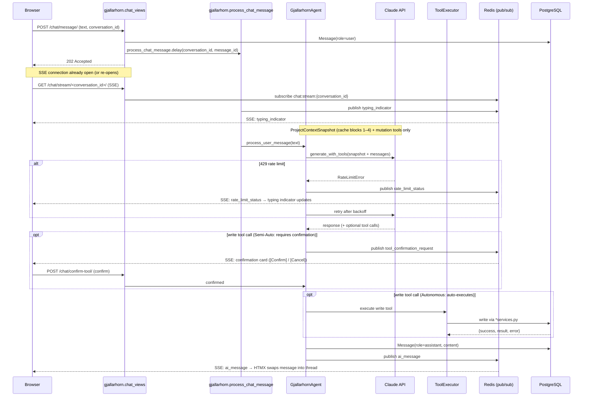

# Huginn: System Architecture Overview

> *Last updated: May 2026 — CloudFront + ACM + CDK `HuginnCdn` deployed; Route53 CNAME via idempotent custom resource; **HSTS** (`max-age=3600; includeSubDomains`) added at CloudFront via `ResponseHeadersPolicy`; ingestion sync schedules Celery fan-out every 5 minutes (per-Project `sync_schedule`); **app CI/CD** is Makefile-driven tag-triggered pipelines (`git tag x.y.z && git push origin x.y.z` → lint → test → build → staging → manual prod promote) — see §9; **SitRep pipeline** three-phase: steps 1–4 are pure data-collection (direct tool calls, no LLM); steps 5…N+4 are per-Variable assessment (one execution-model/Sonnet call each); step N+5 is the single planning-model/Opus call for narrative synthesis + datapoints aggregation*

---

## Executive Summary

Huginn is a Human-AI OODA composite for engineering PMs. It ingests development signals from external sources on a Celery-driven schedule (fan-out every 5 minutes; each **Active** `Project` syncs when due per its `sync_schedule`), computes Master Variables (TRANSPARENCY, THROUGHPUT, CYCLE TIME, REWORK, QUALITY, COMPLEXITY, CONTRIBUTION), and — via **Gjallarhorn AI** — automatically generates a SitRep after each sync. The PM conducts Observe-Orient (OO) with Gjallarhorn in Chat, then approves or rejects its proposed Decisions (Semi-Autonomous mode) or watches Gjallarhorn execute autonomously (Autonomous mode). Gjallarhorn runs on `claude-sonnet-4-6` with extended thinking, caches stable context (Playbook, FRAGOs, Situational Awareness), and executes multi-step tasks via an `ExecutionPlan` / `PlanStep` engine backed by Celery.

**Key architectural decisions:**
- Django MTV + Celery hybrid: web UI and async ingestion in one monorepo
- PostgreSQL + Django ORM — relational model sufficient, no graph DB needed
- Docker Compose everywhere — dev/prod parity, no K8s complexity
- HTMX partial updates + Apache ECharts — server-rendered, testable UI
- AWS Elastic Beanstalk + GitLab CI — tag-triggered release pipelines (`x.y.z` semver tag on `main`); **Makefile** + **`scripts/`** define build/deploy; GitLab wires `make` targets into jobs. Kaniko for daemonless image builds
- Blue/green deployment via `swap-environment-cnames` — two EB environments (`huginn-blue` / `huginn-green`); **staging** deploys to the inactive env first; **production** promotion is a **manual** GitLab job after review. Public DNS `huginn.featurefactory.io` → **CloudFront** (origin = `huginn-prod` EB CNAME); swap does not require Route53 or CloudFront changes
- AWS RDS (PostgreSQL) in production — no containerised DB on EB; local dev retains the `db` Compose service

---

## 1. Application Blocks

**Pattern:** Hybrid — Django MTV for web UI, Celery event-driven for async ingestion.

**Django apps:**

| App | Responsibility |
|---|---|
| `accounts/` | Custom user model (`AUTH_USER_MODEL`), authentication hooks. |
| `ingestion/` | Extraction jobs per source (GitLab, Jira, …). Celery tasks, connector clients, raw data models. |
| `analytics/` | Master Variable computation (TRANSPARENCY, THROUGHPUT, CYCLE TIME, REWORK, QUALITY, COMPLEXITY, CONTRIBUTION). Reads from ingested data, writes computed metrics. |
| `sitrep/` | SitRep records, Decision records, VariableDatapoint records, FRAGO store, Situational Awareness snapshots. (Generation is `gjallarhorn/`'s responsibility.) |
| `ui/` | Django views, HTMX responses, ECharts JSON endpoints, templates. |
| `gjallarhorn/` | FastMCP wrapper exposing Huginn data to AI. Gjallarhorn AI interface. |

**UI architecture:**
- Rendering: server-rendered Django templates
- Interaction: HTMX partial updates (no full page reloads for dashboard interactions)
- Layout: multi-panel (navigation + dashboard + detail/chat)
- Design system: Bootstrap 5 — base component library, grid, typography, utilities (CDN)
- Iconography: Font Awesome Pro — loaded via kit script (CDN)
- Charts: Apache ECharts — data served as JSON from Django views, chart rendered client-side (CDN)

**Dependency rules:**
- `accounts/` → no internal Huginn app dependencies
- `analytics/` → reads from `ingestion/` models
- `sitrep/` → reads from `analytics/` + `ingestion/`
- `ui/` → reads from all apps, no business logic
- `gjallarhorn/` → reads from `sitrep/`, `analytics/`, and `ingestion/`; writes SitRep + Decision records + VariableDatapoints to `sitrep/` in all modes; in Autonomous mode additionally writes FRAGOs + SitAwareness entries and calls `ingestion/` Jira connector to execute Decision outcomes
- `ingestion/` → no internal dependencies

**Ingestion sync engine (foundation):**
- **`ingestion/domain/`** — pure-Python DTOs (dataclasses + ABCs): `IncrementDTO`, `ContributorDTO`, concrete `CommitIncrementDTO`. No Django imports.
- **`ingestion/adapters/`** — `DataSourceAdapter` ABC; per-source modules (e.g. `gitlab_commits.py`) stream `IncrementDTO` instances. Registered in `ADAPTER_REGISTRY` keyed by `DataSource.Type`.
- **`ingestion/services/sync_engine.py`** — `SyncEngine.run_for_project(project_id)` orchestrates: open `IngestionRun`, resolve adapters for the project's `DataSource`, upsert `Contributor` / `Increment` rows idempotently on `(project, kind, external_id)`, close run with counts and cursor, update `Project.last_sync_at` and `sync_state`.
- **Idempotency:** re-running sync is safe — upserts only; duplicate external IDs do not create second rows.
- **Audit:** every run appends an `IngestionRun` row (success or error) for TRANSPARENCY and ops visibility.
- **Scheduling (prod):** `django_celery_beat` `PeriodicTask` `ingestion.sync_due_projects` runs every **5 minutes** (migration `0002_sync_due_projects_beat`). The task enqueues `ingestion.sync_project` per **Active** project when `last_sync_at` is older than that project's `sync_schedule` (hourly, every 6h, or daily).
- **Acceptance:** `docs/features/act-2-projects/projects-sync-engine.feature` encodes scheduling, idempotency, error, concurrency, and archived-skip behavior.

---

## 2. Integration & API Design

**Web UI:** Django views only — no REST API for v1. All UI interactions are HTMX swaps against Django views.

**AI interface:** FastMCP wrapper (`gjallarhorn/`) exposing Huginn data as MCP tools to Gjallarhorn AI.

**Inter-service communication:** Redis + Celery queue (async task dispatch). Django web process enqueues tasks; Celery workers consume them. Redis is also used as a pub/sub broker for SSE event broadcasting — Celery workers publish chat and Plan progress events; `gjallarhorn/views/chat_views.py` subscribes and streams them to browsers via `GET /chat/stream/<conversation_id>/`.

**External source connectors — v1:**

| Source | Library | Version | Notes |
|---|---|---|---|
| GitLab | `python-gitlab` | 8.x | Full REST API coverage: commits, MRs, branches, members |
| Jira | `jira` (pycontribs) | latest | Better Jira-specific coverage than `atlassian-python-api` |

**MVP — Decision → Jira write path:** Issues created by **Branch C** (approved Decision outcomes) authenticate against a **`DataSource` row with type Jira**: same `ingestion/` `DataSource` model GitLab uses, but **wired for outbound REST writes** (`create_jira_issue`) before read-side Jira ingestion ships. Exactly which Jira `DataSource`(s) apply to a workspace (and how the Action Stations mirror picks its source) remains a wiring detail documented with the `Decision`/`ActionStation` implementations.

**External source connectors — TBD (resolve before respective sprint):**

| Source | Library |
|---|---|
| Zoom Notes | TBD |
| Slack / email | TBD |
| XRay (test state) | TBD |

**Ingestion cadence:** Celery Beat (`DatabaseScheduler`) fires `ingestion.sync_due_projects` every **5 minutes**; that task enqueues `ingestion.sync_project(project_id)` for each **Active** project whose `last_sync_at` exceeds its `sync_schedule` (hourly / every 6h / daily). On-demand sync from the UI still calls the same task. OODA loop runs daily at morning planning session.

**Contract approach:** no formal REST contract for v1 (single consumer: the web UI). MCP tools documented inline in `gjallarhorn/`.

---

## 3. Code Organization

**Repository:** monorepo — single repo, all code together.

**Top-level layout:**
```
huginn/
├── accounts/            # AUTH_USER_MODEL, user admin
├── ingestion/
│   ├── domain/          # pure-Python DTOs (IncrementDTO, etc.)
│   ├── models/
│   ├── adapters/        # DataSourceAdapter ABC + per-source extractors
│   ├── integrations/    # HTTP clients (GitlabClient, …)
│   ├── services/        # SyncEngine orchestration, extraction logic
│   ├── tasks.py         # Celery tasks
│   └── tests/
├── analytics/
│   ├── models/
│   ├── services/        # Master Variable computation
│   └── tests/
├── sitrep/
│   ├── models/
│   ├── services/        # SitRep, Decision, FRAGO, VariableDatapoint, SitAwareness CRUD
│   └── tests/
├── ui/
│   ├── views/
│   ├── templates/
│   └── tests/
├── gjallarhorn/
│   ├── llm/             # LLM ABC, ClaudeLLM, retry_on_rate_limit
│   ├── agent/           # GjallarhornAgent, ToolExecutor, prompts
│   ├── mcp_tools/       # FastMCP tool definitions (data, sitrep, decision, plan)
│   ├── models/          # Conversation, Message, ExecutionPlan, PlanStep
│   ├── services/        # sitrep_service, factory
│   ├── tasks/           # plan_tasks, sitrep_tasks
│   ├── views/           # chat_views (HTMX endpoints)
│   ├── templates/       # chat_sidebar.html, chat_fullscreen.html, plan_progress_card.html
│   └── tests/
├── huginn/              # Django project settings
│   ├── settings/
│   │   ├── base.py
│   │   ├── local.py
│   │   ├── production.py
│   │   └── test.py      # pytest: SQLite + locmem + eager Celery
│   ├── urls.py
│   └── celery.py
├── docs/
│   └── architecture/
│       ├── SAO.md
│       └── ADRs/
├── infra/               # AWS CDK (Python) — stacks, Lambda for Route53 upsert
│   ├── app.py
│   ├── cdk.json
│   ├── stacks/
│   └── lambda/
├── docker-compose.yml
├── Makefile
├── pyproject.toml
└── manage.py
```

**Naming conventions:**
- Files: `snake_case.py`, templates: `kebab-case.html`
- Classes: PascalCase, functions/methods: snake_case
- Constants: UPPER_SNAKE_CASE
- URLs: kebab-case (`/sitrep/latest/`)

**Shared utilities:** `huginn/utils/` for cross-cutting concerns (logging helpers, decorators). All apps may import from `huginn/utils/`; no circular imports.

---

## 4. Data Architecture

**Database engine:** PostgreSQL 16+. Rationale: relational model is sufficient — status history as append-only table, aggregation queries via raw SQL where needed. No graph traversal requirements in v1.

**Schema strategy:**
- Django migrations (numbered, tracked in VCS)
- `factory_boy` + `Faker` for test data
- Expand-contract pattern for breaking schema changes

**Core model patterns:**

*UnitOfWork status history (append-only — no graph edges needed):*
```python
class IssueStatusEvent(Model):
    issue_id    = CharField()   # external ID (e.g. "ISS-1")
    status      = CharField()   # "backlog", "planned", "in_progress", "done"
    recorded_at = DateTimeField()
    source      = CharField()   # "jira", "gitlab"
```

*Ingestion — Contributors, Increments, sync runs:*

```python
class Contributor(Model):
    """Reconciled developer identity per DataSource (git author email as key for MVP)."""
    datasource  = ForeignKey(DataSource, on_delete=CASCADE, related_name="contributors")
    email       = EmailField()
    name        = CharField(blank=True)
    handle      = CharField(blank=True)  # optional GitLab username
    first_seen_at = DateTimeField(auto_now_add=True)
    last_seen_at  = DateTimeField(auto_now=True)
    # UniqueConstraint(datasource, email)

class Increment(Model):
    """Discrete ingested contribution; kind discriminator + JSON payload for source-specific fields."""
    project     = ForeignKey(Project, on_delete=CASCADE, related_name="increments")
    datasource  = ForeignKey(DataSource, on_delete=SET_NULL, null=True, blank=True)
    kind        = CharField(max_length=32)  # e.g. "commit"; post-MVP: merge_request, review
    external_id = CharField(max_length=128)  # stable id from source (e.g. commit sha)
    occurred_at = DateTimeField(db_index=True)
    contributor = ForeignKey(Contributor, on_delete=SET_NULL, null=True, blank=True)
    summary     = CharField(max_length=512, blank=True)
    payload     = JSONField(default=dict)  # sha, web_url, branches[], stats, parent_shas
    created_at  = DateTimeField(auto_now_add=True)
    # UniqueConstraint(project, kind, external_id); indexes on (project, occurred_at)

class IngestionRun(Model):
    """One execution of sync for a Project — append-only outcome record."""
    project     = ForeignKey(Project, on_delete=CASCADE, related_name="ingestion_runs")
    datasource  = ForeignKey(DataSource, on_delete=SET_NULL, null=True, blank=True)
    started_at  = DateTimeField(auto_now_add=True)
    finished_at = DateTimeField(null=True, blank=True)
    status      = CharField(max_length=16)  # pending, running, success, error
    cursor_to   = DateTimeField(null=True, blank=True)  # high-water mark (occurred_at) for this run
    increments_ingested = IntegerField(default=0)
    contributors_touched = IntegerField(default=0)
    error_message = TextField(blank=True)
```

**Data access:**
- Django ORM for all CRUD and simple queries
- Raw SQL (via `connection.execute()`) for complex aggregations: cycle time distributions, contribution quadrant coordinates, burndown series

**Caching:**
- Redis as Django cache backend
- Cache computed Master Variable results (TTL: 1 hour, invalidated on new ingestion run)
- Session storage: database-backed (default Django)

---

## 5. Test Strategy

**Frameworks:**
- `pytest` + `pytest-django` as test runner
- Django `TestCase` for unit/integration (DB isolation via transaction rollback)
- Django `LiveServerTestCase` for UI integration tests where needed
- `factory_boy` for test data generation
- `responses` library for mocking external HTTP calls (GitLab, Jira APIs)

**Test pyramid:**
- Unit: services, utilities, Master Variable computation logic
- Integration: Django views (test client), Celery task logic, DB queries
- No E2E (Playwright) for v1 — internal tool, overhead not justified

**ECharts testing approach:** ECharts data served from Django JSON views. Tests assert on the JSON response structure — no browser rendering needed.

**CI gate:** all tests must pass before merge to `main`.

**Makefile targets:** `make test`, `make test-unit`, `make test-integration`. **CDK stack tests:** `tests/infra/` synthesise CDK stacks and assert on CloudFormation templates (no AWS calls); included in `make test` once `infra/requirements.txt` is installed (pulled via root `requirements.txt`). **Pytest** uses `huginn.settings.test` per `pyproject.toml` — not Postgres/Redis.

---

## 6. Performance & Scalability

**Load profile:**
- Concurrent users: 2–5 (internal team)
- Daily burst: morning planning session (~9:00)
- Data volume: grows linearly with team size and sprint count
- Read-heavy: dashboards read far more than ingestion writes

**Async processing:**
- Celery Beat: **5-minute** fan-out — `ingestion.sync_due_projects` (see migration `ingestion/0002_sync_due_projects_beat.py`) enqueues per-project `ingestion.sync_project` when due; `Project.sync_schedule` controls minimum spacing (hourly / every 6h / daily).
- Celery worker: **one** `worker` container in `docker-compose.prod.yml` with **`--concurrency=2`** (two concurrent tasks), sufficient for v1; GitLab API sync load may warrant a larger EB instance type later.
- Priority queues: not needed for v1 (all jobs equal priority)

**Caching:**
- Redis: Celery broker + Django cache
- Computed Master Variables cached for 1 hour
- Static assets: WhiteNoise (served by Django). **CloudFront** terminates TLS for the public hostname and proxies to EB; it is not a separate static-asset CDN (cache policy is disabled for the app)

**Connection pooling:** Django default (persistent DB connections via `CONN_MAX_AGE`).

**Scaling:** vertical (larger EB instance) before horizontal. Re-evaluate at 10+ users.

---

## 7. Error Handling & Resilience

**Celery job failure policy:**
- Retry with exponential backoff (3 attempts, 60s / 120s / 240s)
- On exhaustion: log at ERROR level, skip this run, surface staleness via TRANSPARENCY Master Variable
- No dead-letter queue for v1 — staleness is visible to the PM, not a silent failure

**External API failure taxonomy:**

| Error type | Handling |
|---|---|
| Rate limit (429) | Retry after `Retry-After` header; count as stale if exhausted |
| Auth failure (401/403) | Log at ERROR, alert via CloudWatch, skip |
| Timeout / network error | Retry with backoff, skip on exhaustion |
| Partial data (200 but empty) | Log at WARNING, store what was received |

**Graceful degradation:** TRANSPARENCY Master Variable explicitly tracks data freshness. Stale sources are visible on the dashboard — the PM knows to check the source directly.

**Idempotency:** ingestion tasks are idempotent — upsert pattern on external IDs, safe to re-run.

**Sync failure surfacing:** when `SyncEngine` exhausts retries or catches an unrecoverable API error, the task records `IngestionRun.status=error` and `error_message`, sets `Project.sync_state=error`, and does not partially corrupt existing `Increment` rows. The PM sees sync health on **PROJECTS-VIEW_PROJECT-1** and stale data is visible via the TRANSPARENCY Master Variable once analytics consumes `IngestionRun` / `last_sync_at`.

**Concurrent sync requests:** a second sync for the same Project while an `IngestionRun` is `running` must not create overlapping writers — coalesce or no-op the duplicate (see `projects-sync-engine.feature` scenario PROJECTS-SYNC-06).

---

## 8. Infrastructure

**Runtime:** Docker Compose everywhere — development and production.

**Services (local dev):**
```yaml
services:
  web:     # Django (runserver + debugpy on :8000)
  worker:  # Celery worker
  beat:    # Celery beat (DatabaseScheduler — django_celery_beat)
  redis:   # Broker + cache (redis:7-alpine)
  db:      # PostgreSQL 16 (local only — replaced by RDS in prod)
```

**Services (production — `docker-compose.prod.yml`):**
```yaml
services:
  web:     # gunicorn --worker-class=gthread --workers=2 --threads=4
           # gthread workers allow each worker to serve multiple concurrent SSE streams
           # runs migrate --noinput on startup, mapped :8080→:8000
  worker:  # Celery worker, concurrency=2
  beat:    # Celery beat (DatabaseScheduler)
  redis:   # redis:7-alpine with healthcheck; also used as SSE pub/sub broker
  # no db  — uses RDS
```

**SSE / nginx requirement:** the EB nginx config must not buffer responses from the `/chat/stream/` path — buffering would hold SSE events until the buffer flushes rather than delivering them immediately. Add to `.ebextensions/01_nginx_proxy.config` (alongside the existing upstream patch):
```nginx
location /chat/stream/ {
    proxy_pass         http://127.0.0.1:8080;
    proxy_buffering    off;
    proxy_cache        off;
    add_header         X-Accel-Buffering no;
    proxy_read_timeout 3600s;   # keep SSE connection alive up to 1 hour
}
```

**Local dev:** `make run` starts all services via `docker compose up`. `.env` file provides local config. Django `runserver` runs locally (outside Docker) with F5 / Cursor debugpy launch config; only `db` and `redis` run in Compose containers.

**Production AWS components:**

| Component | Detail |
|---|---|
| Platform | AWS Elastic Beanstalk — *Docker running on 64bit Amazon Linux 2023* |
| EB application | `huginn` |
| EB environments | `huginn-blue`, `huginn-green` (blue/green pair) |
| CNAME for prod | `huginn-prod.us-east-1.elasticbeanstalk.com` — rotates between envs via **`swap-environment-cnames`** (see §9–§10) |
| CNAME for staging | `huginn-staging.us-east-1.elasticbeanstalk.com` — always the inactive env |
| DNS | Route53 CNAME `huginn.featurefactory.io` → **CloudFront** distribution domain. **Origin** (in CDK): `huginn-prod.us-east-1.elasticbeanstalk.com` — stable; **CNAME swap** between blue/green EB envs rotates which env backs that name. CNAME record is applied by CDK (`HuginnCdn` stack) via a **Lambda-backed custom resource**: if the record already matches the CloudFront domain it no-ops; otherwise it UPSERTs (avoids duplicate-record failures when migrating from a direct EB CNAME) |
| Container registry | AWS ECR — `411113550285.dkr.ecr.us-east-1.amazonaws.com/huginn` — tagged by short SHA and `:latest` |
| Database | AWS RDS — PostgreSQL 16, credentials injected as EB environment properties |
| Secrets | AWS SSM Parameter Store — `SECRET_KEY`, DB credentials fetched and promoted to EB env properties |
| Deploy bundle S3 | `s3://elasticbeanstalk-us-east-1-411113550285/huginn/<sha>.zip` |
| Nginx fix | `.ebextensions/01_nginx_proxy.config` — systemd oneshot service patches EB's auto-generated nginx upstream from the unreachable Compose-network IP to `127.0.0.1:8080` (stable `docker-proxy` port) |
| Web container port | `8080:8000` — host 8080 → gunicorn 8000. Required because EB's nginx config template uses the mapped host port. |

**No Kubernetes** — internal tool, team of 2–5, Compose complexity is sufficient.

**Infrastructure as Code:** `infra/` directory contains a Python CDK project with four stacks:

| Stack | Resources | Deploy phase |
|---|---|---|
| `HuginnCdn` (CDK) | ACM cert (`featurefactory.io` + `*.featurefactory.io`, us-east-1), CloudFront (viewer HTTPS → origin HTTP, `CachingDisabled`, `AllViewer` origin policy, **response headers policy** for `Strict-Transport-Security` 1h + `includeSubDomains`), Lambda + custom resource for **idempotent** Route53 CNAME to CloudFront | Phase 1 — **deployed** (CloudFormation stack `HuginnCdn`) |
| `HuginnNetworkStack` | VPC (`10.0.0.0/16`), 2-AZ public/private subnets, NAT gateway, EB SG, RDS SG | Phase 3 |
| `HuginnDataStack` | RDS PostgreSQL 16 (private subnet, encrypted), SSM parameter stubs | Phase 3 |
| `HuginnAppStack` | ECR repo, EB application + blue/green environments (L1), IAM roles, CloudWatch alarms | Phase 4 |

Existing resources (ECR, RDS, EB, IAM) will be brought under CDK management via `cdk import` in phases 2–4. See `infra/` for full stack definitions.

**CDK CLI:** use `npx aws-cdk@2` from the `infra/` directory (Node.js required), or install `aws-cdk` globally. `infra/cdk.json` sets `"app": ".venv/bin/python app.py"` — run `pip install -r requirements.txt` (includes `-r infra/requirements.txt`) so the app venv has `aws-cdk-lib`. **Bootstrap:** the account/region must be CDK-bootstrapped once (`cdk bootstrap aws://<account>/us-east-1`); this creates the `CDKToolkit` stack used for deployments.

---

## 9. CI/CD Pipeline

**Platform:** GitLab CI (`.gitlab-ci.yml`). Repository: `gitlab.com/dp2580/huginn`.

**Design:** The **Makefile** and **`scripts/`** own commands and sequencing. **`.gitlab-ci.yml`** only selects runner images, installs **GNU make** where available, and runs **`make <target>`** (or the same shell script the Make target wraps, for images that do not ship `make` — Kaniko and `release-cli`).

**Workflow rule:** Pipelines run **only** on **semver tags** matching `x.y.z` (e.g. `1.2.3`). No `v` prefix. No `release/` branch required. There is **no** app pipeline on every `main` push.

**To ship:** push a semver tag from `main` — that is the entire trigger:
```bash
git tag 1.2.3 && git push origin 1.2.3
# or:
glab release create 1.2.3
```

**Pipeline stages (app):**
```
lint (make ci-lint)
  → test (make ci-test)
  → infra (child pipeline, only if infra/** changed)
  → build (bash scripts/ci-kaniko-build.sh — same as make ci-build)
  → deploy (make ci-staging-deploy = ci-prepare-aws + staging)
  → release (bash scripts/ci-create-gitlab-release.sh — uses CI_COMMIT_TAG)
  → promote_production (manual: make ci-promote = ci-prepare-aws + swap)
```

**Infra pipeline:** `infra/gitlab-ci.yml` — triggered as a **child pipeline** when **`infra/**` changes** on a matching semver tag. Stages: CDK assertion tests (`tests/infra/`), `cdk diff` (non-blocking), manual `cdk deploy` (stack selectable via `CDK_STACK`). Requires the same AWS GitLab CI variables as EB deploy jobs.

**Stage details:**

| Stage / job | Runner image | What runs |
|---|---|---|
| `lint` | `python:3.12-slim` (+ make) | `make ci-lint` → `scripts/ci-lint.sh` (ephemeral venv + ruff) |
| `test` | `python:3.12-slim` (+ make) | `make ci-test` → `scripts/ci-test.sh` (Node.js for jsii/CDK during pytest collection; `huginn.settings.test`, SQLite, etc.) |
| `infra-pipeline` | (child) | See `infra/gitlab-ci.yml` |
| `build` | `gcr.io/kaniko-project/executor:v1.23.2-debug` | `bash scripts/ci-kaniko-build.sh` — Kaniko pushes `huginn:${CI_COMMIT_SHORT_SHA}`, `huginn:${CI_COMMIT_TAG}`, and `huginn:latest` to ECR |
| `deploy_staging` | `python:3.12-slim` (+ make) | `make ci-staging-deploy` → AWS CLI install + `make staging` → `scripts/deploy-staging.sh` |
| `create_release` | `registry.gitlab.com/gitlab-org/release-cli:latest` | `bash scripts/ci-create-gitlab-release.sh` — GitLab Release for `$CI_COMMIT_TAG` (requires **Job token** permission to create releases, if restricted in project settings) |
| `promote_production` | `python:3.12-slim` (+ make), **manual** | `make ci-promote` → `scripts/promote-prod.sh` after human acceptance |

**Why Kaniko:** GitLab shared runners are Alpine-based and lack a Docker daemon. Kaniko builds without DinD and avoids `glibc` issues with `aws-cli` v2 on Alpine.

**`scripts/deploy-staging.sh` (staging only):**
1. Resolve `LIVE_ENV` / `INACTIVE_ENV` from which EB env currently holds the `huginn-prod` CNAME.
2. Bake `ECR_IMAGE` (`huginn:${CI_COMMIT_SHORT_SHA}`) into Compose, bundle `deploy.zip`, upload, create EB application version (label = short SHA), `update-environment` on **inactive** env with `HUGINN_GIT_REVISION` = `CI_COMMIT_TAG` (or short SHA when no tag), wait.
3. Smoke-test `http://<inactive-cname>/health/` (`revision` must match `HUGINN_GIT_REVISION` / release tag, e.g. `0.5.1`).
4. Clear `HUGINN_RESET_DB` on the inactive env if set.
5. Write `staging.env` with `STAGING_URL` for the GitLab **staging** environment URL. **Does not** swap prod CNAME.

**`scripts/promote-prod.sh` (production promotion):**
1. Re-resolve live/inactive; read inactive env’s **VersionLabel** (short SHA of the deployment **currently on staging**).
2. If **`CI_COMMIT_SHORT_SHA`** is set (GitLab), it **must** equal that label — otherwise abort (avoids promoting a pipeline commit that was never deployed to staging).
3. Read inactive staging `/health/` `revision` (release tag or SHA); `swap-environment-cnames` between inactive and live; smoke `https://huginn.featurefactory.io/health/` for **that** revision (not the EB VersionLabel).

**Local / operator commands (same scripts, AWS credentials required):**

| Make target | Role |
|---|---|
| `make staging` | Deploy a chosen revision **to** inactive EB: **`CI_COMMIT_SHORT_SHA`**, or **`BRANCH=`** ref, or **HEAD**. Image must exist in ECR. |
| `make swap`    | Promote **whatever is on staging now** — **no `BRANCH=`**. Optional `CI_COMMIT_SHORT_SHA` must match inactive `VersionLabel` (CI guard); prod smoke compares `/health/` revision from staging. |
| `make ci-build` | Runs `scripts/ci-kaniko-build.sh` (expects `/kaniko/executor` — use from CI or a matching environment). |

**GitLab CI variables (project-level secrets):**

| Variable | Purpose |
|---|---|
| `AWS_ACCESS_KEY_ID` | IAM deploy user |
| `AWS_SECRET_ACCESS_KEY` | IAM deploy user |
| `AWS_DEFAULT_REGION` | `us-east-1` |
| `ECR_REGISTRY` | `411113550285.dkr.ecr.us-east-1.amazonaws.com` |
| `EB_APP_NAME` | `huginn` |
| `EB_BLUE_ENV` | `huginn-blue` |
| `EB_GREEN_ENV` | `huginn-green` |

**Artifact registry:** AWS ECR — `411113550285.dkr.ecr.us-east-1.amazonaws.com/huginn`.

**Branch strategy:** Trunk development on `main`. **Shipping** a version: tag `x.y.z` on `main` and push — pipeline triggers on the tag. After staging sign-off, run **`promote_production`** in GitLab. No release branch required.

**Cursor / agents (optional):** A **dark-factory** Cursor skill (personal skill: `dark-factory`, see `SKILL.md` in that skill folder) describes milestone → integration → tag → staging → manual promote in LE language. It is **subordinate** to this SAO and the **Makefile** in this repository — reconcile there first.

---

## 10. Release & Rollback

**Deployment strategy:** Blue/green via **`aws elasticbeanstalk swap-environment-cnames`**. Two EB environments (`huginn-blue`, `huginn-green`) are always running. **Staging:** new bits land on the *inactive* env first; smoke and review use that env’s EB CNAME (`STAGING_URL` from the deploy job). **Production:** the manual **`promote_production`** job swaps the `huginn-prod` CNAME to the env that **currently holds the staging deployment** (inactive), then smoke-tests `https://huginn.featurefactory.io` — i.e. you promote **the staging payload you already validated**, not a freshly chosen git ref. **Application deploys do not change Route53** for the public hostname — CloudFront origin remains the `huginn-prod` EB CNAME; only CDK-driven DNS work (e.g. `HuginnCdn`) changes Route53.

**Version tagging:** Git short SHA (`CI_COMMIT_SHORT_SHA`) labels EB application versions and the primary ECR tag. `CI_COMMIT_TAG` (e.g. `0.5.1`) is surfaced in `/health/` via `HUGINN_GIT_REVISION` and is also an ECR tag. **GitLab Release** is created in the pipeline after a successful staging deploy.

**Rollback:** Run **`promote_production` again** only after the *other* env holds the desired bits, or swap CNAMEs again from AWS / EB so traffic returns to the previously live environment (same mechanism as forward promotion). Target: on the order of minutes.

**Release cadence:** Tag-driven. Merge work to `main` as usual; push a semver tag when ready to build, stage, and (after review) promote.

**Hotfix:** Merge fix to `main`, push a new patch tag (e.g. `1.2.4`), run the pipeline, review staging, promote.

---

## 11. Observability

**Logging:**
- Structured JSON logging to stdout
- AWS CloudWatch Logs collects from EB automatically
- Log levels: DEBUG (dev), INFO (prod default), WARNING/ERROR for job failures
- Never log API tokens, credentials, or PII

**Metrics via CloudWatch:**
- Celery job failure rate (CloudWatch alarm: > 2 failures/hour → notify)
- EB instance CPU/memory (standard EB metrics)
- No Prometheus/Grafana for v1 — CloudWatch is sufficient

**Correlation IDs:** Django middleware injects `X-Request-ID` header; included in all log entries.

**AI-layer log fields:** every log line in `gjallarhorn/` should include the following fields when available, enabling grep-based trace reconstruction across Chat, Plans, and tools:

| Field | Source | Example |
|---|---|---|
| `correlation_id` | `X-Request-ID` from request (or frontend-generated ID for async tasks) | `req-abc123` |
| `conversation_id` | `Conversation.id` | `42` |
| `plan_id` | `ExecutionPlan.plan_id` | `uuid-...` |
| `tool` | tool function name | `list_commits` |
| `user` | `request.user.username` | `donland` |

Log pattern:
```
INFO gjallarhorn.agent Executing tool | correlation_id=req-123 | plan_id=abc | tool=list_commits | user=donland
```

To reconstruct a full SitRep generation trace: `grep "plan_id=<uuid>" logs/app.log`.

**Alerting:** CloudWatch alarm → email notification to PM on Celery exhaustion.

---

## 12. Config & Secrets

**Config source:** environment variables everywhere.

**Local:** `.env` file (gitignored) loaded via `envFile` in `.vscode/launch.json`. Django dev server runs locally; only `db` and `redis` run in Docker. `POSTGRES_HOST=localhost` in `.env` (overrides the Docker service name `db`). `REDIS_URL=redis://localhost:6379/0`.

**Production:** AWS EB environment properties (set via EB console or `eb setenv`). EB exports these as shell env vars before running Docker Compose; `docker-compose.prod.yml` uses `${VAR}` substitution to pass them into containers. *(Note: `env_file:` directive does not work on AL2023 — explicit `environment:` blocks required.)*

**Secrets storage:** AWS SSM Parameter Store. Credentials are fetched and set as EB environment properties. GitLab CI credentials (`AWS_ACCESS_KEY_ID`, etc.) are GitLab project-level CI variables.

**Required env vars:**

| Variable | Description | Source (prod) |
|---|---|---|
| `SECRET_KEY` | Django secret key | SSM → EB env property |
| `DJANGO_SETTINGS_MODULE` | `huginn.settings.production` | EB env property |
| `ALLOWED_HOSTS` | e.g. `huginn.featurefactory.io,...` | EB env property |
| `POSTGRES_HOST` | RDS endpoint | EB env property |
| `POSTGRES_DB` | Database name | EB env property |
| `POSTGRES_USER` | DB user | SSM → EB env property |
| `POSTGRES_PASSWORD` | DB password | SSM → EB env property |
| `REDIS_URL` | `redis://localhost:6379/0` (Redis runs in same Compose stack) | EB env property |
| `GITLAB_URL` | GitLab instance URL | EB env property |
| `GITLAB_TOKEN` | GitLab personal access token | SSM → EB env property |
| `JIRA_URL` | Jira instance URL | EB env property |
| `JIRA_USER` | Jira username/email | EB env property |
| `JIRA_TOKEN` | Jira API token | SSM → EB env property |
| `ANTHROPIC_API_KEY` | Anthropic API key for Gjallarhorn LLM calls | SSM `/huginn/ANTHROPIC_API_KEY` → EB env property (injected by `deploy-staging.sh`) |
| `DEBUG` | `False` in prod | EB env property |

**Optional env vars (tuning):**

| Variable | Description | Default | Source (prod) |
|---|---|---|---|
| `PLAN_ORPHAN_PENDING_SECONDS` | Seconds before a `pending` plan is considered orphaned and re-dispatched by the recovery beat task | `300` (5 min) | EB env property |
| `PLAN_ORPHAN_RUNNING_SECONDS` | Seconds before a `running` plan is considered stuck (worker died mid-execution) and reset to `pending` for re-dispatch | `1800` (30 min) | EB env property |

**Sync engine on EB:** ensure `0007_beat_sync_due_projects` has run (`web` runs `migrate` on deploy) so `PeriodicTask` `ingestion-sync-due-projects` exists; `beat` reads it from RDS via `DatabaseScheduler`. Set connector env vars on **both** `huginn-blue` and `huginn-green` (`GITLAB_*`, `JIRA_*`, `ANTHROPIC_API_KEY`, etc.) so either env is valid after a swap. A single `t3.small` runs web + worker + beat + redis — heavy GitLab sync may warrant a larger instance later.

**Plan orphan recovery:** `gjallarhorn.recover_orphaned_plans` runs every **60 s** via `PeriodicTask` registered by migration `gjallarhorn.0002_recover_orphaned_plans_beat`. It re-dispatches plans stuck in `pending` longer than `PLAN_ORPHAN_PENDING_SECONDS` (default 5 min) and resets plans stuck in `running` longer than `PLAN_ORPHAN_RUNNING_SECONDS` (default 30 min) back to `pending` before re-dispatching. `execute_plan` uses `acks_late=True`; `CELERY_BROKER_TRANSPORT_OPTIONS visibility_timeout` is set to **7200 s** (2 h) in `base.py` — must exceed the worst-case task duration.

**Feature flags:** not needed for v1.

---

## 13. Security

**Authentication:** Django session-based auth. Username + password. Small team — no SSO/OAuth for v1.

**Authorization:** single-role (all authenticated users have full access). No RBAC needed for v1.

**Production hardening:**
- `DEBUG=False`
- `SECURE_SSL_REDIRECT=True` — TLS terminated at CloudFront; `X-Forwarded-Proto: https` forwarded via AllViewer origin request policy
- `SESSION_COOKIE_SECURE=True`
- `CSRF_COOKIE_SECURE=True`
- `SECURE_PROXY_SSL_HEADER = ("HTTP_X_FORWARDED_PROTO", "https")`
- `CSRF_TRUSTED_ORIGINS = ["https://huginn.featurefactory.io"]`
- `SECURE_REDIRECT_EXEMPT = [r"^health/$"]` — allows CI smoke test to reach EB CNAME directly over HTTP
- `SECURE_HSTS_SECONDS = 3600` — increase to 31536000 after one week of stable HTTPS
- `ALLOWED_HOSTS` explicitly set

**CSRF:** Django built-in CSRF middleware (on by default). HTMX configured to send CSRF token.

**Input validation:** Django forms + model validation. No user-supplied data flows into raw SQL without parameterization.

**Dependency scanning:** `pip-audit` in CI pipeline. Block merge on critical CVEs.

---

## 14. Backup & Recovery

**Backup:** daily `pg_dump` to S3, triggered by Celery Beat task at 02:00.

**Retention:** 30 daily backups (1 month rolling window).

**RPO:** 24 hours — acceptable for internal analytics tool. If today's SitRep data is lost, re-ingestion from source systems restores it.

**RTO:** restore from S3 dump, `psql` restore, restart EB environment. Target: < 2 hours.

**Makefile targets:** `make backup`, `make restore BACKUP=<s3-key>`

---

## 15. Developer Experience

**IDE:** Cursor.

**Code quality:**
- Linter + formatter: `ruff` (replaces flake8 + black)
- Type checker: `mypy` (optional for v1, recommended)
- Pre-commit hooks: `ruff check`, `ruff format --check`
- Config: `pyproject.toml`

**Makefile targets:**

| Target | Action |
|---|---|
| `make provision` | Install app deps + CDK deps (`infra/.venv` for `aws-cdk` CLI workflows) |
| `make run` | Start all services via Docker Compose |
| `make test` | Run full test suite (`SECRET_KEY` defaulted for pytest-django if unset) |
| `make test-unit` | Run unit tests only |
| `make lint` | Run ruff check |
| `make format` | Run ruff format |
| `make infra-synth` | `cdk synth` (from `infra/` via `.venv/bin/python` in `cdk.json`) |
| `make infra-diff` | `cdk diff` |
| `make infra-deploy-cdn` | `cdk deploy HuginnCdn` |
| `make infra` | `cdk deploy --all` (later phases — use with care) |
| `make backup` | Run pg_dump to S3 |
| `make shell` | Django shell in web container |

**Hot reload:** `runserver` in dev container with volume mount.

**Time-to-first-feature target:** new developer running tests within 30 minutes of `git clone`.

---

## 16. Documentation Strategy

**ADRs:** stored in `docs/architecture/ADRs/`. Standard format:
```
# ADR-NNN: Title
Status: Accepted | Superseded | Deprecated
Context: ...
Decision: ...
Consequences: ...
```

Write an ADR for every significant technology or architecture choice. This SAO.md is the compiled result; ADRs are the audit trail.

**Living documentation:**
- Sphinx-format docstrings on all public methods (`:param:`, `:return:`, `:raises:`)
- Type hints on all public functions
- Comments explain *why*, not *what*
- README hierarchy: root README → per-app README for non-obvious modules

**Knowledge base:** `docs/` in repo. No external wiki.

---

## 17. AI Architecture — Gjallarhorn

### 17.1 Component Layers

```
┌──────────────────────────────────────────────────────────────┐
│                  Chat UI  (HTMX / Django templates)          │
│   CHAT-SIDEBAR-1 (global rail)   CHAT-FULLSCREEN-1 (2-pane) │
│   PlanProgressCard — live updates via SSE stream             │
└────────────────────────┬─────────────────────────────────────┘
                         │  HTMX POST + SSE (htmx-sse)  →  gjallarhorn/views/
┌────────────────────────▼─────────────────────────────────────┐
│                    GjallarhornAgent                           │
│  process_user_message()  /  execute_single_step()            │
│  create_plan()  →  enqueues execute_plan Celery task         │
└──────────────┬──────────────────────┬────────────────────────┘
               │                      │
┌──────────────▼──────┐   ┌───────────▼──────────────────────┐
│    LLM  (ABC)       │   │       ToolExecutor               │
│  ClaudeLLM          │   │  security-context-aware wrapper  │
│  claude-sonnet-4-6  │   │  around all  *services.py        │
│  extended thinking  │   │  FastMCP tool definitions        │
│  retry_on_rate_limit│   └──────────────────────────────────┘
└─────────────────────┘
┌──────────────────────────────────────────────────────────────┐
│              Celery async execution layer                     │
│  execute_plan   /   generate_sitrep_for_project              │
│  execute_decision_outcome (**Autonomous** outcomes + reuse)  │
│  ExecutionPlan  /  PlanStep  (models in gjallarhorn/)        │
└──────────────────────────────────────────────────────────────┘
```

**Dependency rule** (authoritative — §1 matches): `gjallarhorn/` reads from `sitrep/`, `analytics/`, and `ingestion/`; always writes SitRep records + Decision records + VariableDatapoints to `sitrep/`; in Autonomous mode additionally writes FRAGOs + SitAwareness entries and calls the Jira connector via `ingestion/` to execute Decision outcomes.

---

### 17.2 `gjallarhorn/` App Layout

```
gjallarhorn/
├── llm/
│   ├── base.py            # LLM ABC — generate_with_tools() → LLMResponse
│   ├── claude.py          # ClaudeLLM; extended prompt caching; claude-sonnet-4-6-thinking
│   └── retry.py           # retry_on_rate_limit decorator (30 s → 60 s → 120 s exp backoff)
├── agent/
│   ├── agent.py           # GjallarhornAgent(llm, tool_executor); main loop
│   ├── tool_executor.py   # Permission checks + delegates to *services.py
│   └── prompts.py         # Base system prompt (cacheable block)
├── mcp_tools/             # FastMCP tool definitions
│   ├── data_tools.py      # list_commits, list_issues, get_contributor, …
│   ├── sitrep_tools.py    # get_sitrep, list_sitreps, list_decisions, …
│   ├── playbook_tools.py  # get_playbook, list_variables, …
│   ├── decision_tools.py  # approve_decision, create_frago, extend_sitawareness, …
│   └── plan_tools.py      # create_plan
├── models/
│   ├── conversation.py    # Conversation, Message
│   ├── execution_plan.py  # ExecutionPlan
│   └── plan_step.py       # PlanStep
├── services/
│   ├── sitrep_service.py  # build ExecutionPlan from Playbook Workflow
│   └── factory.py         # create_agent(agent_type) factory
├── tasks/
│   ├── plan_tasks.py      # execute_plan; _notify_ai_of_plan_{success,failure}
│   ├── chat_tasks.py      # process_chat_message (enqueued on POST /chat/message/)
│   └── sitrep_tasks.py    # generate_sitrep_for_project (fired on Sync Complete)
├── views/
│   └── chat_views.py      # /chat/message/ (POST→202), /chat/stream/<id>/ (SSE), /chat/, /chat/sidebar/
└── templates/
    └── gjallarhorn/
        ├── chat_sidebar.html
        ├── chat_fullscreen.html
        └── plan_progress_card.html
```

---

### 17.3 LLM Layer

**`LLM` ABC** (`gjallarhorn/llm/base.py`):
```python
class LLM(ABC):
    @abstractmethod
    def generate_with_tools(
        self,
        messages: list[dict],
        tools: list[dict],
        system_blocks: list[dict],   # ordered cache-control blocks
    ) -> LLMResponse: ...

@dataclass
class LLMResponse:
    content: str
    stop_reason: str       # 'end_turn' | 'tool_use'
    usage: dict            # input_tokens, output_tokens, cache_read_input_tokens
    tool_calls: list[dict]
    model: str
```

**`ClaudeLLM`** (`gjallarhorn/llm/claude.py`):
- Accepts a `model` string at construction time; defaults to `claude-sonnet-4-6`.
- Extended thinking enabled per invocation via `thinking: {type: "enabled", budget_tokens: 8000}`.
- Anthropic **extended prompt caching** via `cache_control: {"type": "ephemeral"}` on four stable system blocks (see §17.6). Cache hit avoids re-billing those tokens; Claude's cache TTL is 5 minutes (refreshed on each hit).
- Method `generate_with_tools()` is wrapped with `@retry_on_rate_limit(max_retries=3, base_delay=30, status_callback=...)`. The `status_callback` publishes a `rate_limit_status` SSE event to the conversation's Redis pub/sub channel (e.g. *"Hmm, I'm thinking… Give me 30 seconds."*), which the browser receives in real time via the `/chat/stream/` endpoint (see §17.11).

**Model Assignment Policy** — Gjallarhorn uses three named LLM instances, created by `factory.py` and injected into `GjallarhornAgent`:

| Task | Model | Factory instance | Location |
|---|---|---|---|
| Plan creation — Playbook → `ExecutionPlan` steps | `claude-opus-4-5` | `PlanningLLM` | `sitrep_service.py` / `create_plan()` |
| SitRep narrative synthesis (planning step, `is_planning=True`) | `claude-opus-4-5` | `PlanningLLM` | `execute_single_step` → `_execute_planning_step` |
| Data-collection steps (`is_planning=False`) | **no LLM** | — | `execute_single_step` → `_execute_data_step` (direct tool call) |
| Chat (`process_user_message`) | `claude-sonnet-4-6` | `ExecutionLLM` | `chat_tasks.py` |
| Plan success/failure notifications (`_notify_ai_of_plan_*`) | `claude-haiku-3-5` | `NotificationLLM` | `plan_tasks.py` |

`GjallarhornAgent.__init__` accepts two LLM parameters: `llm` (execution model, used for chat) and `planning_llm` (planning model, used for plan creation and narrative-compose steps). `execute_single_step` routes to `_execute_data_step` (no LLM) or `_execute_planning_step` (single LLM call) based on the step's `is_planning` flag. `factory.py` `create_agent(agent_type)` constructs and injects the correct instances for each role (sitrep generation, chat, decision execution).

---

### 17.4 Agent

**`GjallarhornAgent`** (`gjallarhorn/agent/agent.py`):

| Method | Purpose |
|---|---|
| `process_user_message(user_id, message_text, conversation_id)` | Main chat loop: call LLM, handle tool calls via `ToolExecutor`, iterate until `stop_reason == 'end_turn'`; store `Message` rows |
| `execute_single_step(plan, step)` | Execute one `PlanStep`: records pre-execution `reasoning_why_needed` + `expected_outcome`; calls tool(s); records `result` + `outcome_assessment` |
| `create_plan(conversation, goal, steps)` | Persist `ExecutionPlan` + `PlanStep` rows; enqueue `execute_plan.delay(plan_id)` |

**`ToolExecutor`** (`gjallarhorn/agent/tool_executor.py`):
- Carries `user` and `project` scope; validates permissions before every service call.
- **Read tools** — auto-execute, no confirmation: `list_*`, `get_*`, `find_*`.
- **Write tools** — require an in-Chat confirmation card (`[Confirm] / [Cancel]`) in Semi-Auto; auto-execute in Autonomous (Owner = `"Gjallarhorn"`):
  - `create_frago`, `extend_sitawareness`, `create_jira_issue`, `approve_decision`
- Destructive calls that are never auto-executed regardless of mode: none in MVP (Huginn only creates, never deletes).
- **Standardized response envelope** — every tool call returns:
  ```python
  {"success": bool, "result": ..., "error": str | None}
  ```
  The foundation prompt instructs Gjallarhorn: *"If a tool returns `success: false`, explain what went wrong and suggest an alternative approach. Never swallow errors."*

**Two-tier tool strategy** — Gjallarhorn uses different tool sets depending on context:

| Context | Tool set | Delivery | Rationale |
|---|---|---|---|
| **Chat (conversational)** | Project context snapshot (cached) + write/mutation tools only (~10 tools). No `list_*` / `get_*` calls. | Synchronous; < 1 s response | AI reads from snapshot; minimal API calls; low rate-limit exposure |
| **Plan execution (workflow)** | Full tool set (~40 tools) | Async via Celery; 1–3 min | Complex multi-step analysis needs all data tools |

In Chat, Gjallarhorn receives a pre-built `ProjectContextSnapshot` (active Playbook + FRAGOs + SitAwareness + recent SitReps index) in the prompt — AI reads from it rather than calling `list_*` tools. After any write tool mutates state, the snapshot is invalidated in Redis (5-minute TTL). During Plan execution, the full tool set is available so each step can freely query any entity.

**Two-path step execution** — `execute_single_step` dispatches based on `step.is_planning`:

```
execute_single_step(plan, step):
  if step.is_planning is False  →  _execute_data_step(plan, step):
    1. Look up tool kwargs from plan (from_dt/to_dt → list_commits, at_dt → list_active_fragos, etc.)
    2. Call tool_executor.execute(step.tool, **kwargs) directly — no LLM
    3. step.result = raw tool response {success, result, error}
    4. step.status = 'completed'  (if critical and tool fails → raise ToolExecutionError)

  if step.is_planning is True   →  _execute_planning_step(plan, step):
    1. Gather results from all prior completed data steps (step.result["result"])
    2. Format as structured COLLECTED PROJECT DATA context block
    3. Build system blocks: SITREP_NARRATIVE_SYSTEM_PROMPT + Playbook + FRAGOs + SA (cached)
    4. Single LLM call:  generate_with_tools(messages=[step_prompt + collected_data], system_blocks)
    5. step.result = {tool_results, synthesis}; step.outcome_assessment = LLM content
    6. step.status = 'completed'; step.model_used = response.model
```

For the canonical SitRep plan this means **exactly one Anthropic API call** per generation (step 5). Steps 1–4 are deterministic: they call registered tools directly and store raw data that step 5 reads as context.

---

### 17.5 Plans & Async Execution

**Data models** (`gjallarhorn/models/`):

```python
class ExecutionPlan(Model):
    plan_id          = UUIDField(primary_key=True, default=uuid4)
    conversation     = ForeignKey(Conversation, on_delete=CASCADE, related_name='plans')
    goal             = TextField()
    status           = CharField()   # pending|running|completed|failed|waiting_retry
    retry_count      = IntegerField(default=0)
    max_retries      = IntegerField(default=5)
    celery_task_id   = CharField(blank=True)
    paused_at        = DateTimeField(null=True)
    last_error       = TextField(blank=True)
    last_error_type  = CharField(blank=True)
    retry_after      = DateTimeField(null=True)
    progress_current = IntegerField(default=0)
    progress_total   = IntegerField(default=0)
    progress_message = CharField(blank=True)
    planning_model   = CharField(blank=True)  # model used for plan creation (e.g. claude-opus-4-5) — added in migration 0003
    created_at       = DateTimeField(auto_now_add=True)
    # SitRep-scoped context — set by generate_sitrep_for_project task (migration 0002);
    # NULL on plans created for other purposes (chat, decision execution)
    sitrep_from_dt   = DateTimeField(null=True, blank=True)
    sitrep_to_dt     = DateTimeField(null=True, blank=True)
    sitrep_trigger   = CharField(max_length=16, blank=True, default="")  # 'automatic'|'manual'

class PlanStep(Model):
    step_id              = UUIDField(primary_key=True, default=uuid4)
    plan                 = ForeignKey(ExecutionPlan, on_delete=CASCADE, related_name='steps')
    order                = IntegerField()
    action               = TextField()
    reasoning_why_needed = TextField()
    expected_outcome     = TextField()
    status               = CharField()  # pending|running|completed|failed
    result               = JSONField(null=True)
    outcome_assessment   = TextField(blank=True)
    is_critical          = BooleanField(default=True)  # False → failure skips step, plan continues
    is_planning              = BooleanField(default=False)  # True → single planning-model LLM call (narrative synthesis); False → direct tool call or variable assessment — migration 0003
    is_variable_assessment   = BooleanField(default=False)  # True → single execution-model LLM call per RoE Variable; mutually exclusive with is_planning — Variables sprint migration
    tool                 = CharField(max_length=64, blank=True, default="")  # tool function to call for data steps (e.g. 'list_commits') — migration 0004; empty for planning steps
    model_used           = CharField(blank=True)  # LLMResponse.model, only set on planning steps — migration 0003
    # UniqueConstraint(plan, order)

# In sitrep/ — core SitRep record written after ExecutionPlan completion
class SitRep(Model):
    project              = ForeignKey('ingestion.Project', on_delete=CASCADE, related_name='sitreps')
    generated_at         = DateTimeField(auto_now_add=True, db_index=True)
    from_dt              = DateTimeField()
    to_dt                = DateTimeField()
    trigger              = CharField(max_length=16)     # 'automatic'|'manual'
    mode_at_generation   = CharField(max_length=16, default='semi_auto')  # 'semi_auto'|'auto'
    roe_version          = IntegerField(null=True, blank=True)
    headline             = CharField(max_length=200)
    situation_assessment = TextField()
    notable_activity     = JSONField(default=list, blank=True)
    variables_snapshot   = JSONField(default=list, blank=True)  # immutable copy of datapoints emitted by Gjallarhorn at generation time — [{variable_name, abbrev, y_axis_label, value, color}, …]
    fragos_applied       = ManyToManyField('sitrep.Frago', blank=True, related_name='sitreps_applied_to')
    source_plan          = ForeignKey('gjallarhorn.ExecutionPlan', null=True, blank=True, on_delete=SET_NULL)
    # UniqueConstraint(project, to_dt)  — one SitRep per project per sync window end

# In sitrep/ — one row per RulesOfEngagementVariable per SitRep; powers Variables tab charts + Vitals informer bar
class VariableDatapoint(Model):
    sitrep           = ForeignKey('sitrep.SitRep', on_delete=CASCADE, related_name='datapoints')
    roe_variable     = ForeignKey('roe.RulesOfEngagementVariable', null=True, blank=True, on_delete=SET_NULL)
    variable_name    = CharField(max_length=255)       # denormalized from RoE — frozen at generation time
    y_axis_label     = CharField(max_length=128, blank=True, default='')  # e.g. 'merged MRs', 'days', '% linked'
    from_dt          = DateTimeField()
    to_dt            = DateTimeField()
    value            = CharField(max_length=64, null=True, blank=True)  # string value e.g. '92%', '8d', '15'; null = grey (no data)
    color            = CharField(max_length=16)        # 'green'|'orange'|'red'|'grey'
    source_plan_step = ForeignKey('gjallarhorn.PlanStep', null=True, blank=True, on_delete=SET_NULL)
    created_at       = DateTimeField(auto_now_add=True)
    # UniqueConstraint(sitrep, roe_variable)
```

**`execute_plan` Celery task** (`gjallarhorn/tasks/plan_tasks.py`, `@shared_task(bind=True, max_retries=5)`):

1. `plan.mark_started()` → `status = 'running'`
2. Loop: `step = plan.get_next_pending_step()` → `agent.execute_single_step(plan, step)` → `plan.update_progress()`
3. All steps done → `plan.mark_completed(result)` → `_notify_ai_of_plan_success(plan)` → Agent presents findings in Conversation
4. `RateLimitError` / `TimeoutError` / `NetworkError` → `plan.mark_paused_for_retry(e)` → `raise self.retry(countdown=delay)` — Celery reschedules; **completed steps are never re-run** (`get_next_pending_step()` returns only `pending` steps)
5. Any other exception → `plan.mark_failed(e)` → `_notify_ai_of_plan_failure(plan, e)` → injects `PLAN EXECUTION FAILED` context into Conversation → Agent generates recovery analysis (partial results + concrete options)

**Resilience matrix:**

| Error class | LLM-level (`retry_on_rate_limit`) | Celery-level (`execute_plan`) |
|---|---|---|
| Claude 429 / rate limit | 3 retries: 30 s → 60 s → 120 s; status message in Chat thread | `mark_paused_for_retry` + `self.retry(countdown=delay)`, up to 5 Celery retries |
| Timeout / network error | Same decorator path | Same Celery retry |
| Tool error / data unavailable | Raised immediately (not a rate limit) | `mark_failed` + `_notify_ai_of_plan_failure` → recovery analysis in Chat |

**`PlanProgressCard`** — HTMX partial (`plan_progress_card.html`) embedded in the Chat message thread:
- Updated live via `plan_step_update` / `plan_completed` / `plan_failed` SSE events on the conversation stream (see §17.11); no polling required.
- Displays: goal · progress bar (`3 / 9 steps`) · live step list.
- Step status icons: ○ pending / ⟳ running / ✓ done / ✗ failed / ⏸ waiting (rate-limit retry — shows `retry in Xs`).
- Each step shows pre-execution reasoning (pending/running) or result summary (completed) or error text (failed/waiting).
- `is_critical = False` steps that fail show `⊘ skipped` and the plan continues (post-MVP; MVP defaults all steps to `is_critical = True`).

---

### 17.6 Token Economy & Prompt Caching

Context assembly for each Gjallarhorn invocation:

| Block | Delivery | Typical size | Refresh trigger |
|---|---|---|---|
| Base system prompt (role, output rules, security constraints) | Anthropic cache block 1 | ~2 k tokens | Never — universal |
| Active Playbook (Workflow markdown + PlaybookVariables) | Cache block 2 | 3–8 k tokens | Playbook edit / version bump |
| Active FRAGOs (concatenated body text, enabled only) | Cache block 3 | 1–5 k tokens | FRAGO toggle / edit |
| Situational Awareness capsule | Cache block 4 | 1–3 k tokens | SA edit |
| Previous SitReps | Embedding vector + text index (≤ 500 tokens) | Grows | Never re-sent in full |
| Current-period data (new Increments, sync results, standing open Decisions) | Live tokens | 2–10 k tokens | Every invocation |

**Min-RAG for previous SitReps:** Gjallarhorn receives a short text index (date · period · headline Variable values · Decision count). If it needs detail it calls the `get_sitrep(sitrep_id)` tool — only that SitRep's content is fetched. This keeps the context window bounded as project history grows.

**Cache economics:** Anthropic charges ~10 % of normal input-token price for cache reads. Blocks 1–4 together save ~8–18 k tokens per invocation once warmed. Write cost (first call with a new Playbook) is normal; all subsequent calls within the 5-minute TTL pay the read rate.

**Intra-plan tool-result cache:** Within a single `ExecutionPlan` run, tool calls that share identical arguments are cached in Redis so the same data is not fetched more than once across steps. For example, a seven-Variable SitRep plan would otherwise call `list_commits` seven times with the same `(project, from_dt, to_dt)` — the cache collapses those to one real API call.

- **Redis key pattern:** `plan:{plan_id}:tool:{tool_name}:{sha256(canonical_json(args))}` (no namespace collision with prompt-cache or session keys)
- **TTL:** set to the plan's expected maximum runtime (default 600 s); keys are deleted explicitly by `plan.mark_completed()` / `plan.mark_failed()` — whichever fires first
- **Hook:** `ToolExecutor.call(tool_name, args)` checks for the key before dispatching to the tool function; on cache miss it writes the result after dispatch
- **Scope:** read-only tools only (`list_*`, `get_*`, `find_*`); write tools (`create_frago`, `approve_decision`, etc.) are never cached

**Prompt-cache-block invalidation protocol:** §17.6's existing table describes cache blocks 1–4 with informal refresh triggers ("Playbook edit / version bump"). The following are the code-level invalidation hooks:

| Block | Content | Invalidation trigger | Code hook |
|---|---|---|---|
| 1 | Base system prompt | Never (universal) | — |
| 2 | Active Playbook | `Playbook.save()` / version bump | `sitrep/signals.py` → delete `gjallarhorn:cache_block:{project_id}:2` |
| 3 | Active FRAGOs | FRAGO enable/disable/edit/revoke | `sitrep/signals.py` → delete `gjallarhorn:cache_block:{project_id}:3` |
| 4 | Situational Awareness capsule | SA edit | `sitrep/signals.py` → delete `gjallarhorn:cache_block:{project_id}:4` |

Invalidation deletes the Redis key; the block is rebuilt and re-cached on the next invocation (Anthropic write cost applies once; subsequent calls within the 5-minute TTL pay the read rate again).

**Variable assessment memoization** — deferred. The narrative-only phase writes no `VariableDatapoint` rows (see §17.7 and `sitrep-generate.feature` SITREP-GEN-14). Memoising Variable assessments across syncs (skip LLM call when the data window is unchanged) will be addressed when the Variables sprint implements `VariableDatapoint` production.

---

### 17.7 SitRep Generation Flow

**Triggers:**
- **Automatic** (default): `ingestion.sync_project` success → `generate_sitrep_for_project.delay(project_id, from_dt, to_dt)` where `to_dt = now()` and `from_dt` = time of last SitRep for this Project.
- **Manual**: Commander clicks `[Generate SitRep ▾]` on `PROJECTS-VIEW_PROJECT-1`, selects period (preset or custom `from_date`/`to_date`). View handler calls `generate_sitrep_for_project.delay(project_id, from_dt, to_dt, trigger='manual')` and returns 202; the browser subscribes to the resulting Conversation's SSE stream to show the Plan in progress.

```
Sync Complete
  └─▶ generate_sitrep_for_project (Celery)
        ├─ create Conversation(type='sitrep_generation')
        └─ build_narrative_plan_steps(project, from_dt, to_dt) → 4 + N + 1 steps (N = RoE Variable count; 0 when no RoE):
               step 1   — "Get commits for period"          tool='list_commits'                     is_planning=False  is_variable_assessment=False
               step 2   — "Get contributor activity"        tool='get_contributor_activity'         is_planning=False  is_variable_assessment=False
               step 3   — "Load active FRAGOs in window"    tool='list_active_fragos'               is_planning=False  is_variable_assessment=False
               step 4   — "Load Situational Awareness"      tool='get_active_situational_awareness'  is_planning=False  is_variable_assessment=False
               step 5…  — "Assess {name} ({abbrev})"        tool=''  (one per RoE Variable)         is_planning=False  is_variable_assessment=True  [execution model]
               step N+5 — "Compose SitRep narrative"        tool=''                                 is_planning=True   is_variable_assessment=False  [planning model]
           ──► execute_plan.delay(plan_id)
                  │
                  ├─ steps 1–4 (_execute_data_step):
                  │     tool_executor.execute(step.tool, **date_kwargs)
                  │     → store raw {success, result, error} in step.result
                  │     → NO LLM call
                  │
                  ├─ steps 5…N+4 (_execute_variable_assessment_step):   [Variables sprint]
                  │     inject collected data + Variable's calculating + interpreting rules
                  │     → SINGLE execution-model (Sonnet) LLM call per Variable
                  │     → JSON {"value": "<str>", "color": "green|orange|red|grey"}
                  │     → on parse error: value=null, color='grey' — plan continues
                  │
                  └─ step N+5 (_execute_planning_step):
                        gather results from steps 1–N+4 → COLLECTED PROJECT DATA block
                        + system blocks: SITREP_NARRATIVE_SYSTEM_PROMPT + RoE + FRAGOs + SA
                        → SINGLE planning-model (Opus) LLM call
                        → JSON {headline, situation_assessment, notable_activity,
                                datapoints: [{variable_name, abbrev, y_axis_label, value, color}, …]}
                        → _persist_sitrep_from_plan:
                              SitRep record written (variables_snapshot = datapoints array)
                              VariableDatapoint rows written (one per Variable)
                        ├─ Semi-Auto: Decision.status = 'Proposed'
                        └─ Autonomous: Decision.status = 'Auto-approved'; outcomes executed immediately
```

`VariableDatapoint` is written once per `RulesOfEngagementVariable` per SitRep — the timestamped record powering the Variables tab charts and the Vitals informer bar. Each row stores: `variable_name` + `y_axis_label` (denormalized from the RoE at generation time), `value` (string, e.g. `"92%"`, `"8d"`; `null` = grey/no-data), `color` (`green`|`orange`|`red`|`grey`), `from_dt`/`to_dt` (period boundaries from the SitRep), and a FK to its producing `PlanStep` for full reasoning traceability. `SitRep.variables_snapshot` stores the same data as an immutable JSON array (the frozen record of what Gjallarhorn computed at generation time — not re-computed on read).

**`SITREP-LIST+FIND-1` generation-state rows:** `SitRepListView` additionally queries `ExecutionPlan` rows for the Project where `sitrep_from_dt IS NOT NULL` (i.e., plans created by `generate_sitrep_for_project`) and no `SitRep` with `source_plan = plan` exists yet. Plans with `status ∈ {pending, running, waiting_retry}` render as a **Generating** row (amber spinner + `N/M steps` from `progress_current/progress_total`) floated above completed rows. Plans with `status = failed` render as a **Failed** row (`last_error` reason + [View in Chat] → the plan's `Conversation`, which holds the `_notify_ai_of_plan_failure` recovery analysis). This gives the Commander a persistent order-book view of ongoing and failed generations — not just the ephemeral toast on trigger.

---

### 17.8 Decision Lifecycle

```
Proposed  →  [Commander reviews — Semi-Auto only]
    ├── Approved:  Commander provides Reasoning + chooses outcome branch (A/B/C)
    │       └─▶  Semi-Auto: outcome executes **inline in the Decision approve POST** —
    │            `ToolExecutor` runs synchronously inside the Django view/request.
    │       └─▶  On outcome success → Decision.status='Approved'; Owner=Commander;
    │             Reasoning + outcome_ref stored; Decisions Logic FRAGO gets the usual markdown line
    │       └─▶  Branch C (Jira) failure (timeout/API error) → **Decision stays Proposed**; error returned in HTMX
    │       └─▶  Branches → A: create FRAGO · B: extend SA · C: POST Jira (`HUGINN` label) ·
    │              each may optionally spawn ExecutionPlan afterward for complex fallout
    ├── Rejected:  reject note optional; no Jira from reject path (MVP)
    │       └─▶  Reject note only → Decision.status='Rejected'; usually contributes DL row
    │       └─▶  Vigilance → same creatives as Branch A (FRAGO) or B (SA); Decision stays Rejected
    │       └─▶  Bare reject (no note, no artefacts) → no DL contribution
    └── [Autonomous] Auto-approved:  Gjallarhorn provides machine Reasoning
            └─▶  Decision.status='Auto-approved'; Owner='Gjallarhorn'
            └─▶  Same outcome semantics as Approved; typically runs **inside the SitRep Celery pipeline**
                      (still may call `gjallarhorn.tasks.execute_decision_outcome` or shared service code —
                      not the Semi-Auto HTTP path)
```

**Decisions Logic FRAGO** (`kind='decisions_logic'` — exactly **one** per Project):
- Single markdown body Commander **extends / modifies / removes** (`FRAGOS-EDIT_FRAGO-1`). Most resolved Decisions (**Approved**, **Auto-approved**, **Rejected**) **usually** spawn a structured line on completion; omit for **bare dismiss** and other omission cases (`user_journey.md` Act 9).
- **Structured line canonical format:** one **markdown bullet** per contribution, embedding the fields inline (readable by Commander and LLM alike). Recommended template (` · ` separators):
  `- **2026-05-11 14:03** · Decision: *Increase coverage gates* · Owner: **Donland** · **Approved** · Reasoning: *Ship quality bar before refactor* · Outcome: [FRAGO #42](…) / Jira `HUGINN-302` / SA entry / vigilance refs as applicable`
- Auto-created when **first qualifying line lands**; always Active; not revocable.
- Included as Gjallarhorn cached context (FRAGO block) — **current body** is authoritative, not immutable history.
- **Audit:** general FRAGO rows use **`django-simple-history`** (`HistoricalRecords` on `FRAGO`/equivalent ORM model) so `FRAGOS-VIEW_FRAGO-1`'s toggle/edit timeline is backed by real diffs rather than bespoke log tables — including the Decisions Logic FRAGO whenever it is edited.

---

### 17.9 Operating Modes

| Aspect | Semi-Autonomous (`'semi_auto'`) | Autonomous (`'auto'`) |
|---|---|---|
| SitRep generation | Automatic on Sync Complete | Automatic on Sync Complete |
| Decision status after SitRep | `Proposed` | `Auto-approved` |
| Outcome execution (Semi-Auto) | **`DECISIONS-VIEW`** approve POST awaits `ToolExecutor` **synchronously**; Branch **C Jira failures** leave `Decision` **`Proposed`** | Runs inside SitRep/async pipeline immediately after SitRep persists `Auto-approved` rows |
| Write tool confirmation | Required (in-Chat card) | Auto-executes |
| Owner on Decisions | Commander (human) | `'Gjallarhorn'` |
| Toggle surface | Pill `[Semi-Auto \| Auto]` on `PROJECTS-VIEW_PROJECT-1` top bar | ← same |
| DB field | `Project.gjallarhorn_mode = 'semi_auto'` | `Project.gjallarhorn_mode = 'auto'` |

Autonomous mode is intended after a training period: the Commander has reviewed enough Decisions and provided Reasoning that adjustments to the Playbook/FRAGOs are stable. There is no automated gate — the Commander flips the toggle manually.

---

### 17.10 Event-Driven Invocation

| Event | Source | Celery task | Action |
|---|---|---|---|
| `Sync Complete` | `ingestion.sync_project` success | `gjallarhorn.tasks.generate_sitrep_for_project` | Build ExecutionPlan from Playbook Workflow; run steps; write SitRep + Decisions |
| `Decision Approved` | Commander submits Approve (+ Reasoning + branch) — Semi-Auto | *(none — synchronous)* | `ui` Decision view calls `ToolExecutor` / `*services.py` **in the HTTP request**; Branch C Jira errors leave `Decision` **`Proposed`** |
| `Decision Made` (auto) | Autonomous SitRep path — Gjallarhorn auto-approve | `gjallarhorn.tasks.execute_decision_outcome` (or inline in `generate_sitrep` chain) | Execute outcome branch (FRAGO / SitAwareness / Jira); may spawn ExecutionPlan for multi-step |
| Chat message | HTMX POST `/chat/message/` → 202; Celery task; SSE push | `gjallarhorn.tasks.process_chat_message` | Store message, enqueue task, push `ai_message` + any Plan events via SSE stream |

MVP events: `Sync Complete`, Commander-side synchronous **Decision Approved** handling (HTTP), and **`Decision Made` / auto-outcomes** inside the autonomous pipeline (`execute_decision_outcome` shared code). Chat-initiated Plans are also in MVP.

---

### 17.11 Chat Architecture

**Models** (`gjallarhorn/models/conversation.py`):

```python
class Conversation(Model):
    user              = ForeignKey(User, on_delete=CASCADE)
    project           = ForeignKey('ingestion.Project', on_delete=CASCADE, null=False)
    title             = CharField(blank=True, default='')
    agent_identity    = CharField()     # 'gjallarhorn'
    conversation_type = CharField()     # 'ad_hoc'|'sitrep_generation'|'decision_execution'
    created_at        = DateTimeField(auto_now_add=True)
    class Meta:
        constraints = [
            models.UniqueConstraint(
                fields=['user', 'project'],
                name='uniq_conversation_user_project',
            ),
        ]
    # Note: no 'status' field — retry messages are pushed as SSE events, not stored

class Message(Model):
    conversation = ForeignKey(Conversation, on_delete=CASCADE, related_name='messages')
    role         = CharField()    # 'user' | 'assistant' | 'system'
    content      = TextField()
    created_at   = DateTimeField(auto_now_add=True)
```

**Message flow (SSE-based):**

```
1. User sends message
   POST /chat/message/  →  202 Accepted
   (Message stored; Celery task enqueued: process_chat_message)

2. Browser holds open SSE connection
   GET /chat/stream/<conversation_id>/  →  text/event-stream

3. Celery task calls LLM → publishes events to Redis pub/sub channel
   ← event: typing_indicator      (immediately on task start)
   ← event: rate_limit_status     ("Hmm, thinking… 30s" — from retry callback)
   ← event: ai_message            (full response when LLM completes)
   ← event: plan_started          (if Agent creates an ExecutionPlan)
   ← event: plan_step_update      (per completed / failed step)
   ← event: plan_completed        (all steps done)
   ← event: plan_failed           (step failure; includes partial results)
```

**Server side** (`gjallarhorn/views/chat_views.py`):
- `POST /chat/message/` — stores `Message(role='user')`, enqueues `process_chat_message.delay(conversation_id, message_id)`, returns `202`.
- `GET /chat/stream/<conversation_id>/` — `StreamingHttpResponse(event_generator(), content_type='text/event-stream')`. The generator subscribes to `redis.pubsub()` on channel `chat:stream:{conversation_id}` and yields SSE-formatted events until the connection closes. Requires `proxy_buffering off` on nginx (see §8).

**Client side** — HTMX `htmx-sse` extension:
```html
<div hx-ext="sse" sse-connect="/chat/stream/{{ conversation.id }}/">
  <div sse-swap="ai_message"        hx-target="#thread" hx-swap="beforeend"></div>
  <div sse-swap="plan_step_update"  hx-target="#plan-{{ plan_id }}" hx-swap="outerHTML"></div>
  <div sse-swap="rate_limit_status" hx-target="#typing-indicator" hx-swap="innerHTML"></div>
</div>
```

**URL routes** (`gjallarhorn/urls.py`):

| URL | Method | View | Purpose |
|---|---|---|---|
| `/chat/message/` | POST | `send_message` | Store message, enqueue task, return 202 |
| `/chat/stream/<conversation_id>/` | GET | `chat_stream` | SSE stream — pushes all chat + plan events |
| `/chat/sidebar/` | GET | `sidebar` | Full sidebar render |
| `/chat/` | GET | `fullscreen` | Full-screen two-pane chat |

**`gjallarhorn/views/` update** — remove `chat_views.py` entry for `plan-status/<plan_id>/`; add `chat_stream`. Also update `gjallarhorn/tasks/` — add `process_chat_message` task alongside `plan_tasks.py`.

**Conversation threading:** `CHAT-SIDEBAR-1` and `CHAT-FULLSCREEN-1` share **one persistent `Conversation` per `(authenticated user, Project)` pair** (`UniqueConstraint` on `[user_id, project_id]`). Changing the Commander's navigation to a **different Project** loads that Project's Conversation (distinct `conversation_id`/message queryset). Expanding sidebar → fullscreen passes through the active Project's conversation id so the SSE stream target stays stable; SSE reconnect re-subscribes to `chat:stream:{conversation_id}`.

---

### 17.12 Component Interaction Sequence Diagrams

Three primary flows showing how components interact end-to-end.

---

#### Flow A — Sync Complete → SitRep Generation

```mermaid
sequenceDiagram
    participant Beat as CeleryBeat
    participant SyncTask as ingestion.sync_project
    participant GitLab as GitLab API
    participant DB as PostgreSQL
    participant SitRepTask as gjallarhorn.generate_sitrep
    participant Agent as GjallarhornAgent
    participant LLM as Claude API
    participant ToolExec as ToolExecutor
    participant Redis as Redis (pub/sub)
    participant Browser as Browser (SSE)

    Beat->>SyncTask: sync_due_projects (every 5 min)
    SyncTask->>GitLab: fetch commits / MRs since cursor
    GitLab-->>SyncTask: IncrementDTOs
    SyncTask->>DB: upsert Increment rows (idempotent on external_id)
    SyncTask->>DB: write IngestionRun(status=success)
    SyncTask->>SitRepTask: generate_sitrep_for_project.delay(project_id, from_dt, to_dt)

    SitRepTask->>DB: create Conversation(type=sitrep_generation)
    SitRepTask->>Agent: create_plan(goal, steps=[...])
    Agent->>DB: create ExecutionPlan + PlanSteps
    Agent->>SitRepTask: execute_plan.delay(plan_id)
    SitRepTask->>Redis: publish plan_started
    Redis-->>Browser: SSE: plan_started → PlanProgressCard appears in Chat

    loop steps 1–4: data collection (no LLM)
        Agent->>ToolExec: _execute_data_step — call step.tool directly (list_commits / get_contributor_activity / list_active_fragos / get_active_situational_awareness)
        ToolExec->>DB: query via *services.py
        DB-->>ToolExec: {success, result, error}
        ToolExec-->>Agent: raw tool result
        Agent->>DB: step.result = raw data; step.status = completed
        Agent->>Redis: publish plan_step_update
        Redis-->>Browser: SSE: plan_step_update → step shows ✓ done
    end

    Note over Agent,LLM: step 5 only — single LLM call with all collected data
    Agent->>Agent: _execute_planning_step — gather results from steps 1–4
    Agent->>LLM: generate_with_tools(COLLECTED DATA + SITREP_NARRATIVE_SYSTEM_PROMPT + Playbook + FRAGOs + SA)
    alt 429 rate limit
        LLM-->>Agent: RateLimitError
        Agent->>Redis: publish rate_limit_status ("Hmm, thinking 30s…")
        Redis-->>Browser: SSE: rate_limit_status → step shows ⏸ waiting
        Agent->>LLM: retry after 30 s / 60 s / 120 s
    end
    LLM-->>Agent: JSON {headline, situation_assessment, notable_activity}
    Agent->>DB: step.result = synthesis; step.status = completed
    Agent->>Redis: publish plan_step_update
    Redis-->>Browser: SSE: plan_step_update → step shows ✓ done

    Agent->>DB: _persist_sitrep_from_plan → create SitRep(from_dt, to_dt, trigger, mode_at_generation)
    Agent->>DB: create Decision records (Proposed or Auto-approved)
    Agent->>DB: contribute SitRep-cycle Decisions to Decisions Logic FRAGO (usual; curator may edit later)
    Agent->>Redis: publish plan_completed
    Redis-->>Browser: SSE: plan_completed → PlanProgressCard → Done
```

---

#### Flow B — Commander Chat Message → SSE Response



---

#### Flow C — Commander Approves Decision → Outcome Executed

```mermaid
sequenceDiagram
    participant Browser as Browser
    participant Views as ui.decision_views
    participant ToolExec as ToolExecutor
    participant JiraAPI as Jira API
    participant Agent as GjallarhornAgent
    participant DB as PostgreSQL
    participant Redis as Redis (pub/sub)

    Browser->>Views: POST /decisions/id/approve/ (branch, Reasoning)

    alt Branch A — create FRAGO
        Views->>ToolExec: create_frago(project, title, body)
        ToolExec->>DB: FRAGO persisted
    else Branch B — extend SitAwareness
        Views->>ToolExec: extend_sitawareness(entry)
        ToolExec->>DB: SA entry persisted
    else Branch C — create Jira issue (credentials via DataSource Jira)
        Views->>ToolExec: create_jira_issue(summary, description)
        ToolExec->>JiraAPI: POST /rest/api/3/issue
        alt Success
            JiraAPI-->>ToolExec: issue key (HUGINN-NNN)
        else Failure
            ToolExec-->>Views: error
            Views->>DB: Decision remains Proposed
            Views-->>Browser: HTMX error toast / partial with message
            Note over Views,Browser: No Approved status; no DL line on Branch C failure
        end
    end

    opt outcome success paths for A/B or successful C only
        Views->>DB: Decision.status Approved; Reasoning outcome_ref finalized
        Views->>DB: append markdown bullet row to Decisions Logic FRAGO
        Views-->>Browser: HTMX partial Decision Approved
    end

    opt Branch follow-up Plan (optional)
        Views->>Agent: create_plan(goal, steps)
        Agent->>DB: ExecutionPlan + PlanSteps + Celery enqueue
        Note over Agent,Redis: same async Plan SSE path as Flow A
        Agent->>Redis: publish plan_started
    end
```

**Contract:** Semi-Automatic MVP uses **single HTTP request semantics** above so the Commander never observes an `Approved` Decision whose Jira issue never landed. Autonomous executions keep using the Celery/async flavor described in §17.8 (`execute_decision_outcome` helper code **shared** with the view-layer service whenever practical).

---

## Technology Stack

| Layer | Tool | Version | Install (macOS) | Install (Linux) | Verify |
|---|---|---|---|---|---|
| Language | Python | 3.12+ | `brew install python@3.12` | `apt install python3.12` | `python3 --version` |
| Framework | Django | 5.x | `pip install django` | `pip install django` | `django-admin --version` |
| Async | Celery | 5.x | `pip install celery` | `pip install celery` | `celery --version` |
| Broker/Cache | Redis | 7.x | `brew install redis` | `apt install redis` | `redis-cli --version` |
| Database | PostgreSQL | 16+ | `brew install postgresql@16` | `apt install postgresql` | `psql --version` |
| Charts | Apache ECharts | 5.x | CDN — no install | CDN — no install | loaded in base template |
| Design system | Bootstrap | 5.x | CDN — no install | CDN — no install | loaded in base template |
| Connector | python-gitlab | 8.x | `pip install python-gitlab` | `pip install python-gitlab` | `pip show python-gitlab` |
| HTTP retries | tenacity | 9.x | `pip install tenacity` | `pip install tenacity` | `pip show tenacity` |
| Connector | jira (pycontribs) | latest | `pip install jira` | `pip install jira` | `pip show jira` |
| AI interface | FastMCP | latest | `pip install fastmcp` | `pip install fastmcp` | `pip show fastmcp` |
| SSE (Chat) | htmx-sse extension | latest | CDN — no install | CDN — no install | loaded in base template |
| Model history | django-simple-history | latest | `pip install django-simple-history` | same | exposes FRAGO histories for UI |
| Test runner | pytest + pytest-django | 8.x | `pip install pytest pytest-django` | `pip install pytest pytest-django` | `pytest --version` |
| HTTP mocking | responses | latest | `pip install responses` | `pip install responses` | `pip show responses` |
| Test data | factory_boy | latest | `pip install factory_boy` | `pip install factory_boy` | `pip show factory_boy` |
| Linter | ruff | 0.6+ | `pip install ruff` | `pip install ruff` | `ruff --version` |
| Container | Docker Compose | 2.x | `brew install docker` | `apt install docker-compose` | `docker compose version` |
| CI/CD | GitLab CI + GNU make | — | — | — | `release/x.y.z` pipelines; see §9 |
| Build (CI) | Kaniko | v1.23.2 | — | — | `scripts/ci-kaniko-build.sh` |
| Deploy | AWS CLI + EB | — | `pip install awscli` (optional) | same | `make staging` / `make swap`; see §9 |
| VCS | git | 2.x | `brew install git` | `apt install git` | `git --version` |
| Build | make | 4+ | bundled on macOS | `apt install make` | `make --version` |
| IaC | AWS CDK (Python) | 2.x | `pip install aws-cdk-lib` | `pip install aws-cdk-lib` | `cdk --version` |

---

## Connector Libs — Remaining Sources (TBD)

The following sources are planned but connector libs not yet selected. Resolve before the respective sprint:

| Source | Signal type | Lib |
|---|---|---|
| Zoom Notes | MFUs → outstanding items, blockers, risks | TBD |
| Slack / email | Outstanding items, blockers, risks | TBD |
| XRay | Test state: red/green/gray | TBD |

---

## Key Decisions Summary

| Domain | Decision | Rationale |
|---|---|---|
| DB (local) | PostgreSQL 16 in Docker Compose | Dev/prod parity; simple to spin up |
| DB (prod) | AWS RDS PostgreSQL | Data survives EB instance replacement; managed backups |
| UI | Django + HTMX + ECharts | Server-rendered = testable; no SPA complexity; ECharts handles scatter/quadrant |
| Infra | Docker Compose on EB AL2023 | Internal tool; K8s overhead not justified; EB manages EC2 |
| Deploy strategy | Blue/green via **`swap-environment-cnames`** | Zero-downtime; staging on inactive env first; manual promote job; instant rollback by re-swapping |
| DNS | Route53 `huginn.featurefactory.io` → CloudFront; origin `huginn-prod.*` | Public name stable; EB prod CNAME is CloudFront origin and rotates via swap; no Route53 edit per deploy |
| CI platform | GitLab CI | Repo is on GitLab; native integration |
| CI builds | Kaniko | Shared runners are Alpine; Kaniko is daemonless, no glibc needed |
| Image registry | AWS ECR | Co-located with EB/IAM; no extra auth needed |
| Secrets | AWS SSM → EB env properties | Credentials never in git or image |
| Async | Celery + Redis + `django_celery_beat` | 5-minute `sync_due_projects` fan-out + per-Project `sync_schedule`; DatabaseScheduler persists periodic tasks in RDS |
| Connectors v1 | python-gitlab + jira (pycontribs) | Both actively maintained; `jira` preferred over `atlassian-python-api` for Jira-specific coverage |
| Testing | pytest + Django test client, no E2E | Internal tool; browser E2E overhead not justified; ECharts tested via JSON endpoints |
| Observability | AWS CloudWatch | Co-located with EB; no additional tooling needed |
| Chat streaming | SSE (`htmx-sse` + `StreamingHttpResponse` + Redis pub/sub) over HTMX polling | LLM responses and Plan progress need real-time push; polling adds 1–5 s lag and wastes requests; SSE is a unidirectional long-lived HTTP stream compatible with Django sync views when using `gthread` workers; Celery workers publish to Redis pub/sub, the `chat_stream` view subscribes and streams to browser |
| FRAGO auditing | **`django-simple-history`** on FRAGO rows | Gives `FRAGOS-VIEW_FRAGO-1`'s chronological toggle/edit timeline without bespoke `FRAGOEvent` tables |
| Semi-Auto Decision approvals | Branch outcomes run **inside the Django view/request** (`ToolExecutor`). Branch **C**: Jira **failure → stay `Proposed`** | Avoids orphaned `Approved` rows when Jira is down/timeouts exceed patience; aligns with synchronous UX |
| AI model tiering | Opus (`claude-opus-4-5`) for plan creation + narrative synthesis; Sonnet (`claude-sonnet-4-6`) for Chat; Haiku (`claude-haiku-3-5`) for plan success/failure notifications | Reasoning depth proportional to task complexity; data-collection steps are deterministic tool calls — no model needed |
| SitRep pipeline execution | Three step types: (1) data-collection steps (`is_planning=False`, `is_variable_assessment=False` — direct `ToolExecutor` call, no LLM); (2) per-Variable assessment steps (`is_variable_assessment=True` — one execution-model/Sonnet LLM call per `RulesOfEngagementVariable`, returns `{value, color}`); (3) narrative-composition step (`is_planning=True` — single planning-model/Opus LLM call, returns `{headline, situation_assessment, notable_activity, datapoints[…]}`). `_persist_sitrep_from_plan` writes the `SitRep` row, `variables_snapshot` JSON, and one `VariableDatapoint` row per Variable. | Minimises planning-model (Opus) token cost to one call per SitRep; execution-model (Sonnet) used for repeatable per-Variable assessments; data-collection steps are fully deterministic; tool-result cache prevents duplicate API calls within a plan run. |
| Execution-layer caching | Intra-plan tool-result cache (Redis, scoped to `plan_id`, cleared on termination); explicit prompt-cache-block invalidation via Django signals | Prevents duplicate `list_commits` calls across Variable steps in the same plan; makes prompt-cache block freshness code-anchored rather than informal |
| Conversation scope | Exactly **one** `gjallarhorn.Conversation` (`UNIQUE(user, project)`), plus optional `conversation_type` | Sidebar + fullscreen share SSE + history per Project boundary |
| Decision → Jira credentials | Stored on reusable **`DataSource(type=jira)`** rows powering `create_jira_issue` | Mirrors GitLab cred pattern; ingestion read-side adapters can reuse the row later |
| Decisions Logic lines | Canonical **single markdown bullet** template per contribution (human + LLM readable) | Matches product decision; deterministic rendering for tooling |
| TLS | CloudFront + ACM | ACM in us-east-1 (`featurefactory.io` + `*.featurefactory.io`); CloudFront in front of EB `huginn-prod` origin; Django `SECURE_SSL_REDIRECT=True` + `SECURE_PROXY_SSL_HEADER` |
| IaC | AWS CDK (Python) | `infra/` — `HuginnCdn` stack deployed; Network/Data/App stacks + `cdk import` for legacy resources tracked as later phases |

---

## Discovered Patterns & Lessons Learned

### Critical Discoveries

**`pytest` / CI test job uses `huginn.settings.test`; no Postgres or Redis containers needed.**
`pyproject.toml` sets `DJANGO_SETTINGS_MODULE=huginn.settings.test` for pytest (SQLite `:memory:`, locmem cache, `CELERY_TASK_ALWAYS_EAGER`). The GitLab `test` job installs Node.js only for CDK/jsii during `tests/infra/` collection — not for app runtime.

**EB AL2023: `env_file:` does not work.**
`env_file: /opt/elasticbeanstalk/deployment/env` fails with "file not found" on Amazon Linux 2023. EB exports environment properties as shell env vars *before* running Docker Compose. The correct pattern is explicit `environment:` blocks with `${VAR}` substitution in `docker-compose.prod.yml`.

**EB nginx upstream points to unreachable container IP.**
EB's platform agent auto-generates `/etc/nginx/conf.d/elasticbeanstalk-nginx-docker-upstream.conf` with the container's Compose-network IP (e.g. `172.23.0.3:8000`), which is not routable from the EB host. The fix is a systemd oneshot service (`.ebextensions/01_nginx_proxy.config`) that sleeps 5 s after `nginx.service` starts and patches the upstream to `127.0.0.1:8080` — the stable `docker-proxy` host port. The `appdeploy/post` hook fires *before* nginx config is written, so it cannot be used for this fix.

**Web container must map port `8080:8000`.**
EB's nginx config template uses the host-mapped port. Port 80 is taken by nginx itself. The chain is: public :80 → nginx → `127.0.0.1:8080` (docker-proxy) → gunicorn :8000 inside the container.

**`django_celery_beat` must be in `INSTALLED_APPS`.**
The `beat` Celery container crashed at startup with `RuntimeError: Model class django_celery_beat.models.SolarSchedule doesn't declare an explicit app_label`. Fix: add `"django_celery_beat"` to `INSTALLED_APPS` in `huginn/settings/base.py`.

**`SECURE_SSL_REDIRECT=True` breaks HTTP-only EB.**
Enabling Django's SSL redirect on an EB environment without TLS causes an infinite redirect loop (HTTP 301 to a dead HTTPS endpoint). Enabled only after CloudFront + ACM cert is deployed. Exempt `/health/` via `SECURE_REDIRECT_EXEMPT` so the CI smoke test can still reach the EB CNAME directly over HTTP.

**CDK `from_lookup()` requires AWS credentials during `cdk synth`.**
`HostedZone.from_lookup()` in the CDN stack makes an AWS API call at synthesis time. Tests bypass this by passing a `hosted_zone` built with `HostedZone.from_hosted_zone_attributes()`. After first successful `cdk synth`, CDK can cache the lookup in `cdk.context.json` (optional to commit).

**Route53 CNAME already existed (direct EB) — `AWS::Route53::RecordSet` create failed.**
A second CNAME for `huginn.featurefactory.io` conflicts with the existing record. Fix: manage the record with a **Lambda custom resource** that compares the current CNAME target to the CloudFront domain — **no-op if already correct**, **UPSERT** if it still points at Elastic Beanstalk or anything else. Deployed as part of `HuginnCdn`.

**EB in default VPC (Phase 3 gap).**
Current infrastructure (EB, RDS) lives in the default AWS VPC (`vpc-a2af05df`, `172.31.0.0/16`). `HuginnNetworkStack` creates a dedicated VPC. RDS migration requires a snapshot restore; EB environment recreation requires a maintenance window. Tracked as Phase 3/4 of the CDK migration.

**Kaniko is required for ECR builds on GitLab shared runners** (see §9).
GitLab's shared runners are Alpine-based; `aws-cli` v2 binary is not compatible with Alpine (`glibc` missing). The `build` job uses Kaniko (`gcr.io/kaniko-project/executor:v1.23.2-debug`) via `scripts/ci-kaniko-build.sh` — no Docker daemon and no glibc on the builder.

**Blue/green swap direction must be verified before executing.**
`swap-environment-cnames` is directional: swapping twice in the same direction returns to the original state, not the desired one. Always check which env holds the `huginn-prod` CNAME (`aws elasticbeanstalk describe-environments ... --query CNAME`) before running **`promote_production`** or `make swap`.

**Font Awesome Pro Kit uses domain allowlisting.**
Icons loaded via `https://kit.fontawesome.com/<kit-id>.js` are silently blocked if the serving domain is not in the kit's allowed-domains list on fontawesome.com. Domains to add: `huginn.featurefactory.io`, `huginn-prod.us-east-1.elasticbeanstalk.com`, `huginn-staging.us-east-1.elasticbeanstalk.com`.

**`collectstatic` fails silently at Docker build time.**
`SECRET_KEY` is not available at build time. The `RUN python manage.py collectstatic --noinput 2>/dev/null || true` line in the `Dockerfile` silently skips if `SECRET_KEY` is missing. Static files are served by WhiteNoise from the source tree. *(Revisit if static assets are missing in prod.)*

**Local DNS caching masks correct DNS propagation.**
After Route53 changes, the local machine may serve stale records from its DNS cache. Flush with `sudo dscacheutil -flushcache && sudo killall -HUP mDNSResponder` (macOS) or temporarily add the entry to `/etc/hosts`.

**Local Django dev server vs Docker Compose hostname resolution.**
When running Django `runserver` locally (outside Docker), `POSTGRES_HOST=db` cannot be resolved — `db` is a Docker Compose service name. Override with `POSTGRES_HOST=localhost` in `.env` to reach the Docker-mapped port `5432`.

**FastMCP tools: `sync_to_async` must use `thread_sensitive=True`.**
FastMCP tool functions are `async def`. When they wrap Django ORM operations via `sync_to_async`, omitting `thread_sensitive=True` causes transactions to **silently roll back** — the tool returns a success dict but the database shows old values, with no exception raised.

Root cause: `thread_sensitive=False` (the default) runs the sync function in a thread-pool thread with a **new** database connection. `@transaction.atomic` commits on that connection, which is then discarded on thread return — implicit rollback.

```python
# Wrong — transaction rolls back silently
@mcp.tool()
async def create_frago(...):
    return await sync_to_async(_create_frago)(...)

# Correct — shares the Django DB connection
@mcp.tool()
async def create_frago(...):
    return await sync_to_async(_create_frago, thread_sensitive=True)(...)
```

Also: use `inspect.iscoroutinefunction(func)` in `ToolExecutor` to detect whether a tool is async — not `hasattr(func, '__wrapped__')`. The `@transaction.atomic` decorator adds `__wrapped__` to sync functions, causing false positives that would attempt `async_to_sync` on a sync function.

**FRAGO edit/toggle auditing:** Persist `FRAGOS-VIEW_FRAGO-1`'s chronological **state change log** via **`django-simple-history`** (`HistoricalRecords`) on every FRAGO model row (including Decisions Logic). Rendering can map history rows → `{timestamp, action, actor}` without inventing bespoke `FRAGOStateChange` tables.

---

### Retrospective Updates

- **CI platform pivoted from GitHub Actions → GitLab CI** during execution; SAO initially specified GitHub Actions / GHCR.
- **Database pivoted from containerised Postgres → RDS** during execution; removes data loss risk on EB instance replacement.
- **Rolling → blue/green** adopted for zero-downtime deploys: new revision lands on the **inactive** EB env and is smoke-tested (**staging**); **`promote_production`** / `make swap` performs the **CNAME swap** to production after review (see §9–§10).
