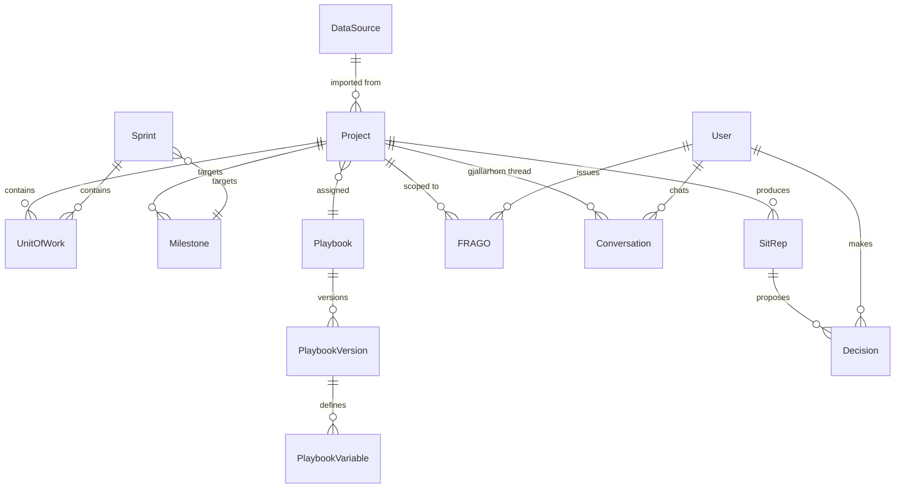
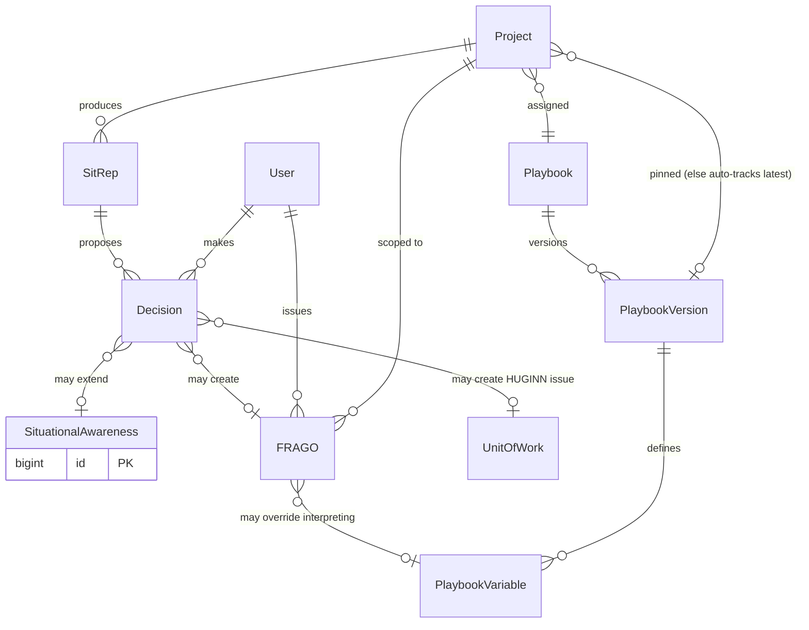
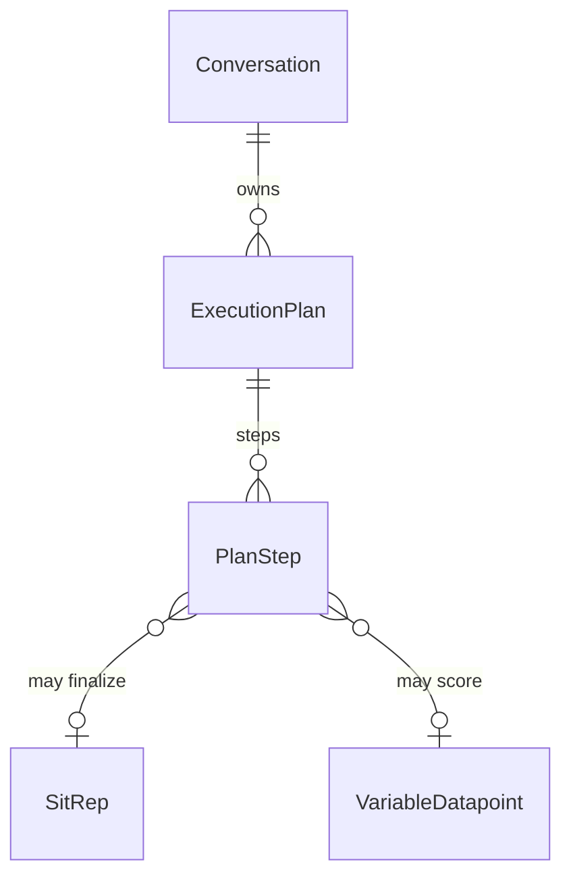
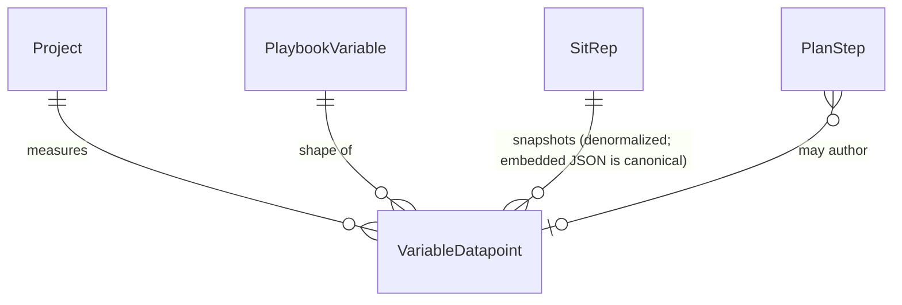
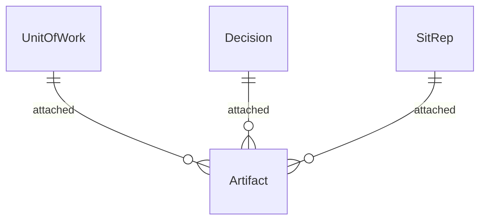
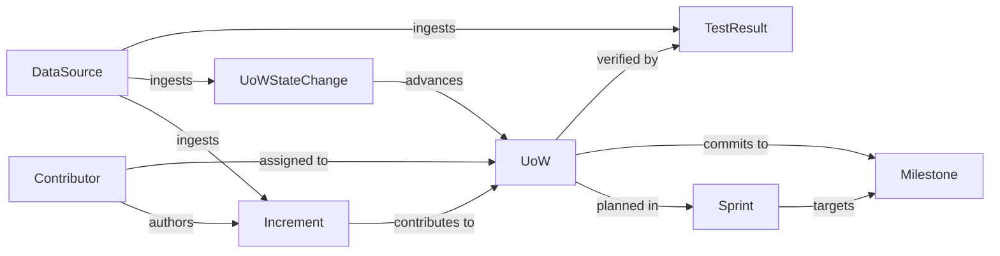

# The Composite: Huginn - Human-AI OODA for  PM

> *Saved from conversation — April 13, 2026*

---

## Seed: On Command and Composite Cognition

**Command as equation-solving:** Human + AI composite: identify the variables, solve the system, implement — ruthlessly or sneakily, whatever the topology of the problem demands. Boyd's OODA, Clausewitz's Schwerpunkt, implicit guidance and control — all variations of the same idea.

**The Composite framing** (Cheris/Jedao as archetype):
- Shared problem representation
- Asymmetric capabilities mapped to subproblems
- A trust/authority protocol that evolves as the mission unfolds
- Neither component can solve the problem alone — the composite is load-bearing

**Why do we need this? Loop tempo -> operation tempo: outthink the enemy**

The side cycling faster wins. The composite  multiplies your tempo giving you an advantage: find bottlenecs & design tasks to be handed to people/agents.

---

## Composite Cognition — Applied Science Foundation

**Distributed cognition** (Hutchins, *Cognition in the Wild*, 1995): cognition is distributed across people, artifacts, and representations. A navigation team isn't six people thinking — it's one cognitive system with six nodes.

**Extended mind theory** (Clark & Chalmers, 1998): cognitive processes can extend into tools. The boundary of "mind" is functional, not anatomical.

**Transactive memory systems** (Kozlowski et al.): high-performing teams don't share all knowledge — they share *knowledge about knowledge*, and route problems accordingly. Maps directly to human+AI composites.

**Empirical signal** (Noy & Zhang, MIT/QJE, 2023): AI assistance didn't just speed up writing — it changed cognitive strategy. Workers offloaded different parts of the problem than expected. That's cognitive restructuring, not tool use.

### Known failure modes
- **Automation bias** — humans over-trust AI under cognitive load; composite becomes less capable than either alone (Parasuraman & Manzey)
- **Skill atrophy** — AI consistently handling a subproblem causes human capability loss; composite degrades in ways neither component would alone
- **Representation mismatch** — human and AI solving slightly different problems because internal representations diverged; invisible until catastrophic

### What a well-functioning composite requires
- Shared problem representation — both nodes working on the same formulation
- Explicit uncertainty signaling — AI communicates confidence, not just answers
- Dynamic authority allocation — who leads on which subproblem shifts as the problem evolves
- Productive friction — a composite that never disagrees has silenced one node

---

## OODA Decomposition for the PM

### The decomposition

| Phase | Owner | Rationale |
|-------|-------|-----------|
| **O1 — Observe** | AI primary | Sensor fusion, pattern detection, recall without fatigue. Human doing first-O alone is slower and noisier. |
| **O2 — Orient** | Composite | Destruction and reconstruction of mental models. AI brings pattern libraries and consistency; human brings contextual judgment, stakes awareness, skin-in-the-game heuristics. |
| **D — Decide** | Human | Requires someone who bears the consequences. Fog is thickest here. Human judgment least replaceable. |
| **A-prep** | AI | Planning, dependency mapping, scenario modeling. |
| **A-exec** | Human | Execution is yours - create Jira issues for me in the managerial backlog. But AI observes in real time, feeds directly into next O1, including failure to act. |

---

## Personas

### Commander Donland — the PM running the loop

**Role**: Project Manager / Commander. Bears the consequences. Final call on Decisions.

**A day in the life**:

- **09:00 — Projects Dashboard.** Donland lands on the Projects Dashboard. Each Project is a status card colored red / orange / yellow / green, derived from the latest SitRep's overall assessment vs. its assigned Playbook. He scans for trouble in seconds — anything red or orange gets opened first.
- **Reading a SitRep.** For each problem Project he opens the latest SitRep: situation assessment narrative, Variables snapshot, proposed Decisions. When the assessment surprises him in a legitimate way — *"Active Bug Count = 0 — but Friday afternoons routinely run 1–2"* — he creates a **FRAGO** to override the Playbook expectation in flight: *"belay that on Fridays, ≤3 OK"*. FRAGOs are short markdown bodies with optional time/scope filters; Gjallarhorn reads them alongside the Playbook on the next SitRep.
- **Querying Gjallarhorn.** When the SitRep doesn't answer the question he has, he opens the chat (sidebar or full-screen). **Chat threads are keyed per `(authenticated user, Project)`** — changing Project swaps conversation history while pinned context/metadata follow that scope (see SAO §17.11).
- **Making Decisions.** Each **approved** Decision branches into exactly one of three mutually-exclusive outcomes: a new FRAGO, an extension of Situational Awareness, or a `HUGINN`-tagged Jira issue (**Branch C**) created via Jira REST, authenticated with the workspace **`DataSource` (type Jira)** credentials. **Semi-Automated MVP:** Commander **Approve** persists that outcome **synchronously inside the Decision review POST** (`ToolExecutor` / services); Branch **C** failures keep the Decision **`Proposed`** until a retry succeeds. **Reject** may still attach optional vigilance (FRAGO / SA) — see [`docs/features/user_journey.md`](../features/user_journey.md) Act 9. **Judgment memory** for *how reasoning evolved per Project* lives primarily in one **Decisions Logic** FRAGO body (canonical **markdown-bullet** contributions — [`docs/architecture/SAO.md`](../architecture/SAO.md) §17.8).
- **Verifying.** He glances at Action Stations — a read-only sync of `HUGINN`-tagged Jira issues — to confirm what landed. Resolution happens in Jira itself; Huginn does not edit Jira beyond creating these issues.

**Implications for the product** (to carry into ESM):
- Primary landing surface is the **Projects Dashboard** (color-coded health), not a generic dashboard or a single-Project SitRep.
- **Playbook** is the user-authored guidance for what good looks like. Composed of metadata + a Workflow markdown body + a structured list of PlaybookVariables. Versioned. Shared: one Playbook can be assigned to many Projects. Each Project pins a (Playbook, version), auto-tracking the latest version by default.
- **FRAGO** is a per-Project markdown override of Playbook expectations with optional scope (day-of-week, date range, Sprint/Milestone) and an optional `PlaybookVariable` tag. Includes the curator-managed **Decisions Logic** specialization for judgment memory (**markdown-bullet** lines + **`django-simple-history`** tracking). May retune a variable's `interpreting` for a window; cannot introduce new variables. Not a watcher with triggers — it modifies how SitReps are produced.
- **Decision** has a three-branch approve flow (**FRAGO / SA / Branch C `HUGINN` Jira**), XOR per Decision — **persisted synchronously inside the Semi-Automated Decision review POST** (Branch C retries keep **`Proposed`** on failure).
- **Action Stations** is a read-only mirror of `HUGINN`-tagged Jira issues. The only Huginn → Jira write is the issue creation from Decision Branch C. No annotation, no comment write-back.
- **Jira / GitLab / etc.** are systems of record for raw work data. Huginn ingests via **DataSources**; the **only** write-back to upstream Jira issues is **`HUGINN`-tagged issues from approved Decision Branch C**, using **`DataSource(type=Jira)`** PAT/API credentials (writes may precede richer Jira ingestion coverage).

---

## Key Entities

Huginn's domain is organized into four concerns: the **canonical work model** (what we analyze), **command & doctrine** (how we decide and act), **measurement & events** (what we observe), and **identity & configuration** (who and where).

**Ingestion principle**: the analytical layer operates on canonical types (`UnitOfWork`, `Milestone`, `Sprint`, `Increment`). Adapters translate source-system concepts at the edge:

- Jira Issue / GitLab Issue / GitHub Issue / Linear Ticket → **UnitOfWork**
- Jira Version / GitLab Milestone / GitHub Milestone / Linear Project → **Milestone** *(the planning container — mutable scope, due date, burndown target)*
- Jira Sprint / GitLab Iteration → **Sprint**
- *(post-MVP)* GitLab Release / GitHub Release / Jira Version with `released=true` → **Release** *(the artifact — immutable, tag-anchored, realizes one or more Milestones)*

GitLab and GitHub separate the planning container (Milestone) from the shipped artifact (Release). Jira conflates them into a single Version entity that flips a `released` flag. The canonical model treats them as two distinct types so OODA-relevant signals (burndown, scope drift, commitment) attach to the Milestone, while artifact-shaped questions (what shipped, regression baseline) attach to the Release. MVP only ingests Milestone; Release is reserved for a later iteration.

For synchronized surfaces (Action Stations), the upstream tool remains system of record. For analytics, the canonical projection is authoritative.

### Canonical Work Model

| Entity | Source of truth | Notes |
|--------|----------------|-------|
| **UnitOfWork** | Upstream tool (Jira etc.), mirrored | The atom of trackable work. UoWs created via Decision Branch C are tagged `HUGINN` in Jira; Action Stations is the read-only mirror of these. Otherwise UoWs are normal engineering work flowing to Milestones. |
| **Milestone** | Upstream tool, mirrored | The planning target — a forward-looking, scope-mutable container with a due date. UoWs commit to it; Sprints target it; burndown is computed against it. (GitLab/GitHub Milestone, Jira Version, Linear Project.) |
| **Sprint** | Upstream tool, mirrored | Time-boxed cohort of UoWs targeting a Milestone. Sprint burndown is the short-cycle view; Milestone burndown is the long-cycle view. |
| **Release** *(post-MVP)* | Upstream tool, mirrored | The shipped artifact — immutable, tag-anchored, references the Milestone(s) it realizes. Surfaces artifact-shaped signals (deployed scope, regression baseline). Not in MVP scope; placeholder so the rename is intentional rather than ambiguous. |

### Command & Doctrine

| Entity | Source of truth | Notes |
|--------|----------------|-------|
| **SitRep** | Huginn | Generated per Project after a successful sync (subject to SitRep cadence, which may be coarser than sync cadence). **Generation contract**: Gjallarhorn expands the Workflow into an **`ExecutionPlan`** with **`PlanStep`** rows (one Claude tool loop per step by default — variable gather/assessment, datapoint persistence, compose narrative/proposed Decisions). Final outputs are a situation assessment narrative + proposed/auto-approved Decisions + `variables: [{name, abbrev, value, color, hover}, …]`. Values land in **`SitRep.variables_snapshot`** (canonical) **and** **denormalized `VariableDatapoint` rows**, each referencing the producing **`PlanStep`** when applicable. Read-only once finalized. |
| **Decision** | Huginn | DA-loop primitive. **Semi-Automated**: `Proposed` by SitRep Plans; Commander **Approve** (**Reasoning required**) or **Reject** (reject note optional, vigilance FRAGO/SA allowed). Approving executes **exactly one** mutually-exclusive Branch **A/B/C** inline in HTTP (unless Autonomous pipelines delegate to Celery helpers). **`HUGINN` Jira issues are approve-only** (no Jira outcome on bare reject paths for MVP). **Autonomous**: `Auto-approved` with machine reasoning and immediate outcome execution inside the ingestion/SitRep task chain (`execute_decision_outcome` helpers). Canonical audit memory also flows into the Decisions Logic FRAGO (markdown bullets per SAO). |
| **FRAGO** | Huginn | Per-Project, in-flight override of Playbook expectations. Free-form markdown body with optional scope (day-of-week, date range, Sprint/Milestone) and an optional `PlaybookVariable` tag. **May retune the `interpreting` of an existing PlaybookVariable for its effective window; cannot introduce new variables.** Has an `enabled` flag the Commander toggles from the list/detail view — disabled FRAGOs are excluded by Gjallarhorn at SitRep generation regardless of their effective window, useful for short-term suspension. Includes the special **`Decisions Logic`** row (`kind=decisions_logic`) — Commander-curatable memory for completed Decision reviews (**markdown bullets** appended by default when memory is warranted — see SAO §17.8). **Toggle/edit timelines** reuse **`django-simple-history`** snapshots rather than bespoke log tables for MVP. Soft-delete (revoke) preserves history; revoked FRAGOs cannot be re-enabled. Not a watcher — modifies how SitReps are produced. |
| **SituationalAwareness** | Huginn | **Workspace-global** durable narrative memory (one versioned capsule per tenant/workspace, not keyed by Project). Extended via Decision Branch B; read by Gjallarhorn **for every** SitRep alongside that Project's Playbook and FRAGOs. |
| **Playbook** | Huginn | What good looks like for a project. Composed of (a) **metadata** — name, description; (b) a **Workflow** — free-form markdown describing the OO/DA narrative for this Project, who is who, what to look for; (c) an ordered list of **PlaybookVariables** (structured). Workflow can be typed inline, uploaded as MD, or pulled from Mimir Server (post-MVP). Shared: one Playbook can be assigned to many Projects. Distinct from the OO/DA *procedures* run internally by Gjallarhorn. |
| **PlaybookVersion** | Huginn | Immutable snapshot of a Playbook. Created on every Playbook edit. Has version number, change summary, author, `workflow_markdown`, and a snapshot of the PlaybookVariables defined at that version. A Project pins a (Playbook, version) — auto-tracks latest by default; can be pinned explicitly to keep an older version. |
| **PlaybookVariable** | Huginn | Per-PlaybookVersion definition of one measurement. Fields: `name` (e.g. "Cycle Time"), `abbreviation` ("CT"), `calculating` (free text — may be a JQL query, a count/ratio expression, or a natural-language prompt; the Agent decides how to apply), `interpreting` (rules mapping value → color, e.g. "<5d & not climbing → green; climbing → orange; >5d → red"), `hover` (tooltip text shown on the project card and in the SitRep snapshot). FRAGOs may retune `interpreting` for a window. |

**Project view tabs** are **system-defined**, not Playbook-derived:
- **Vitals** — hardcoded, system-wide for every Project. Contains: Identity / Playbook / Sync metadata cards; a hardcoded **Transparency** card; and the **informer bar** — one colored dot per `PlaybookVariable` on the active PlaybookVersion (in declared order), showing `name (abbrev)` with value and color on hover.
- **Variables** — one diagram per `PlaybookVariable` on the active PlaybookVersion, showing `VariableDatapoint` history for the selected period — **hour- and day-level presets** (`last 2 hours` … **30 days**) plus custom datetime ranges. Drilldown traces each datapoint to its **SitRep + originating `PlanStep`**. Empty states when Playbook absent or devoid of Variables.
- **Adapter-driven tabs** — one tab per registered ingestion adapter, contributing system-defined views of ingested data. Today: the **Increments** tab, contributed by `ingestion/adapters/gitlab_commits.py`. New adapters add new tabs as they land; the tab set is determined by code, not by Playbook configuration.

### Measurement & Events (append-only)

| Entity | Source of truth | Notes |
|--------|----------------|-------|
| **UoWStateChange** | Huginn (ingested) | Transitions of a UoW (state, assignee, estimate, sprint). Each change *advances* the UoW through its lifecycle. Feeds cycle time, lead time, estimation drift. |
| **Increment** | Huginn (ingested) | A discrete contribution — commit, PR, review, doc update — attributed to a Contributor and linked to the UoW it advances. |
| **TestResult** | Huginn (ingested, XRay) | Red / green / gray; feeds Quality variable. Shown in the Canonical Work Model diagram (UoW ← verified by — TestResult) rather than Measurement, because the relationship is to the work item, not the Project aggregate. |
| **VariableDatapoint** | Huginn (computed) | Single `(Project, PlaybookVariable, from_dt/to_dt interval, value, color, …)` row. Denormalized from `SitRep.variables_snapshot`; references **`PlanStep`** / `ExecutionPlan` for audit ("why did this point look like X?"). Missing values render `grey`/`null`. |

### Cross-cutting

| Entity | Source of truth | Notes |
|--------|----------------|-------|
| **Artifact** | Huginn (user-supplied or ingested) | PDFs, chat extracts, Confluence links, meeting notes. Attachable to UoWs, Decisions, and SitReps — spans all concerns. Cross-linking fabric. |

### Identity & Configuration

| Entity | Source of truth | Notes |
|--------|----------------|-------|
| **User** | Huginn | Huginn account. Roles: `Commander`, `Analyst` (TBD if distinct). |
| **Contributor** | Huginn (reconciled) | Developer identity unified across git author / Jira assignee / Slack handle. Derived profile: Pathfinder / Mastermind / Firefighter / Observer. |
| **Project** | Huginn (imported) | An imported project from a single DataSource (one upstream project = one Project; e.g., one GitLab project). Pins a `(Playbook, version)` evaluated against ingest signals. **`sync_schedule` MVP values:** **`hourly` · `every_6h` · `daily`** (Celery beat fan-out every 15 min checks staleness vs that cadence — see SAO §1). **SitRep cadence may be coarser than sync** to throttle LLM spend (Open Questions remain for ultra–high-frequency future ingest cadences). **Cannot be blank-created** — only via Import. Tracks **`gjallarhorn_mode`** (`semi_auto | auto`). |
| **DataSource** | Huginn config | Connection primitives for GitLab/Jira/etc. (**base URL**, **PAT/API token**, **`expires_at`**, status). Imports Projects from GitLab today; **`DataSource(type=Jira)`** also anchors **Decision Branch C** outbound REST writes + Action Stations pulls even before full Jira ingestion breadth ships. |
| **Conversation / ExecutionPlan / PlanStep** | Huginn (`gjallarhorn/` app) | `Conversation`: **exactly one per `(User, Project)`** for sidebar/full-screen Chat SSE threads. **`ExecutionPlan`** + **`PlanStep`**: Gjallarhorn's scaffold for multi-step work (SitRep generation, chunky Decision fallout). Each `PlanStep` captures pre/post reasoning, tool payloads, statuses; **`VariableDatapoint`** rows link back when the step authored that assessment. Older docs referred to **`AgentInvocation`** — treat **`PlanStep` (+ optional LLM/router metadata)** as the audit primitive going forward unless/until we reintroduce a separate invocation ledger. |

---

## Domain Model (Draft)

Read the **overview** first for the spine; then drill into the four focused views (each small enough to read without edge clutter).

### Overview

### Canonical Work Model

### Command & Doctrine

**Decision outcome semantics**: an **Approved** Decision surfaces **exactly one** of FRAGO / SituationalAwareness extension / `HUGINN`-tagged UoW (`UnitOfWork`). **Semi-Automated:** those writes complete **before the HTTP response returns**; **Branch C Jira errors** keep the Decision **`Proposed`** (no orphan `Approved`). The mermaid optional cardinalities show branches individually; XOR is enforced in application services.

#### SitRep execution trace (`ExecutionPlan` / `PlanStep`)

### Measurement

The embedded `SitRep.variables_snapshot` JSON is the canonical record of what Gjallarhorn saw at SitRep generation time. `VariableDatapoint` rows carry the same values denormalized for cheap trend queries (Variables Deep-Dive, history charts). FRAGOs may tag a `PlaybookVariable` and override its `interpreting` rules for a window, but never introduce new variables.

### Cross-cutting — Artifact Attachments

### Work Flow DAG

How work originates and flows toward Milestone as the planning sink. Every path is directed and acyclic — Milestone has no outgoing edges within the analytical layer. The two paths UoW→Sprint→Milestone and UoW→Milestone (direct fix-version equivalent) form a diamond, not a cycle. *(Post-MVP: a Milestone is realized by a Release artifact; that edge is intentionally omitted from MVP analytics.)*

**Open questions** (to resolve before ESM Activity 04 formalizes this):
1. **UoW ↔ Milestone**: can a UoW commit directly to a Milestone without going through a Sprint? (Assumed yes — matches Jira's `fixVersion` without an active sprint.)
2. **Decision outcome XOR enforcement**: enforce mutual exclusion at DB level (CHECK constraint over three nullable FKs) or at application level only? Affects how loud failures are when invariants drift.
3. **PlaybookVersion content immutability**: confirmed immutable in MVP. Future question: rebase / cherry-pick across versions?
4. **Contributor reconciliation**: identity unification across git/Jira/Slack is a known-hard problem. MVP assumes manual mapping table.
5. **Single-Project MVP?**: the model supports N Projects, but MVP UI may treat the Projects Dashboard as the single landing surface and not expose Project-switching elsewhere. Affects navigation and scope-picker placement.
6. **SitRep cadence vs sync cadence**: **MVP `Project.sync_schedule`** is **`hourly | every_6h | daily`** (15-minute beat checks staleness). SitRep generation stays LLM-heavy — optional throttles independent of sync may be needed if future releases add faster ingest. See **Open product decisions** in `docs/features/user_journey.md`.
7. **PlaybookVariable.calculating typing**: leave as free text and let the Agent route between deterministic evaluation (e.g. JQL, count expression) and LLM interpretation, or add an explicit `calc_kind: query | formula | prompt` hint? Current default: free text + Agent decides.

**Resolved** (no longer open):
- ~~Playbook scope~~: shared across Projects, versioned, Project pins (Playbook, version) with auto-track-latest as default. Composed of metadata + Workflow markdown + ordered list of `PlaybookVariable` (structured).
- ~~FRAGO trigger semantics~~: FRAGO is not a watcher. It is a markdown override of Playbook expectations consumed by Gjallarhorn at SitRep generation time. May retune `interpreting` of an existing PlaybookVariable for its window; cannot introduce new variables.
- ~~SitRep ↔ Variable storage~~: **embed in SitRep** (`variables_snapshot` JSON, canonical) **+ denormalized `VariableDatapoint` rows** for trend queries. Both written at SitRep generation time.
- ~~Variables as platform Master Variables~~: Variables are PlaybookVersion children (`PlaybookVariable`). The seven master variables (Transparency, Throughput, Cycle & Lead Time, Rework, Quality, Complexity, Contribution) become the **starter set on FeatureFactory Playbook** (the seed Playbook), not platform invariants. `MasterVariableDefinition` is removed.
- ~~AI model identity location~~: model id, base prompt, caching, and prompts live in the **`gjallarhorn` LLM/agent layer** (`ClaudeLLM`, foundation prompts) — not on individual `PlaybookVariable` rows. Doctrine entities stay model-agnostic.
- ~~AI execution audit~~ (`AgentInvocation` drafts): **standardized on `ExecutionPlan` + `PlanStep` rows** referencing `Conversation` / Celery jobs; `VariableDatapoint.source_plan_step` (or equivalent FK) links scored values to the originating step. Revive a separate `AgentInvocation` ledger only if MCP multi-agent routing demands it.

---

## Data Foundation — What We Will Have

| Source | Signal type | Resolution |
|--------|------------|------------|
| GitLab/GitHub (no squash commits) | Work in progress, commit frequency, PR cycle time | Hours |
| Jira (issue-to-branch traceability) | Ticket state, flow efficiency, estimation drift | Daily |
| FastMCP wrapper | AI-queryable interface to Huginn | Real-time |
| Messaging (eg emails/Slack messages etc.) | outstanding items, blockers, risks
| Zoom Notes | MFUs -> outstanding items, blockers, risks
| Custom Artifacts | whatever PDF/MD files we can NER-extract info from & fit into our
| Test State | from XRay: red/green/gray
| Coverage | command like tools/existing reports in the repo structure - does green from test state means we are good or it means we have few tests?
[ To be extended later]

## How do we read data
These are dimensions we analyze through the OODA cycle: codebase, backlog, production cycle, release, [infra] environment, UX (user experience), DX (developer experience).

**Variables are user-defined per Playbook** (see `PlaybookVariable` in Command & Doctrine). The set below is the **starter pack** shipped with **FeatureFactory Playbook** (the seed Playbook); any Playbook may add, remove, or replace any of them. FRAGOs may retune a variable's `interpreting` for a window, but cannot introduce new variables.

The **seed Playbook** (**FeatureFactory Playbook**) ships with each starter Variable already defined — name, abbreviation, default `calculating`, default `interpreting`, and `hover`. Donland can clone or edit **FeatureFactory Playbook**. Project view tabs are system-defined (see *Project view tabs* above) and do not depend on Playbook configuration.

Default starter Variables:

TRANSPARENCY: do we know whats actually happening - do our systems contain enough fresh data to make decisions?
THROUGHPUT: WoW do we push more work or less, both as user-visible story points and hidden function-based complexity-adjusted pts?
CYCLE & LEAD TIME: WoW do we push units of work faster or slower? Because of engineering or no (cycle time for eng activities)?
REWORK: What % of what we are pushing is rework? What kind of rework - downstream fucked it up?
QUALITY: test success rate  & test coverage, number of Defects and "Mean Time to Evict"
COMPLEXITY: looking at the current project (lets assume 1 project is one repo; can be a collection of repos later) whats the maintanability index?
CONTRIBUTION: in terms of profile "Y for new code and X axis for churn in existing" who are pathfinders (new code mostly), masterminds (both new and churn - all over the system), firefighters (mostly churn existing codebase), observers (their contribution is too small to classify them eiether way)
[ To be extended later]

SitRep: momentary snapshot of the current values + AI performing first pass of analysis: hypotheses on why there are undesired deviations + suggested Actions to test hypotheses + Decisions to make → execute.

## OO Procedure (Gjallarhorn internal)

> *Note*: this is Gjallarhorn's internal procedure for producing a SitRep — system behavior, not the user-editable **Playbook** entity. The Playbook entity (Workflow markdown + ordered PlaybookVariables) is what good looks like for a specific Project; this procedure describes how Gjallarhorn evaluates against it.

**Multi-step Plan contract:** Gjallarhorn still receives the same contextual bundle `(SituationalAwareness, pinned PlaybookVersion: Workflow + PlaybookVariables, enabled in-window FRAGOs, ingested data for {from_dt → to_dt})`, but **execution** is an **`ExecutionPlan`** with ordered **`PlanStep`s** — hybrid tool loop per step (`execute_single_step`). Final composition steps produce the SitRep narrative + proposed Decisions + Variables payload. Outputs write `SitRep.variables_snapshot` (canonical) plus `VariableDatapoint` rows (with `PlanStep` lineage). The numbered steps below remain the *doctrine* checklist Gjallarhorn honors while stepping through the Plan.

0. Load Situational Awareness / latest SitRep / active FRAGOs / pinned PlaybookVersion (Workflow + PlaybookVariables) — what we know from previous OODA passes, things to watch for per commander's overrides.
1. Check transparency — how stale are updates on Jira issues & pushes? Stale (not today) → flag first.
2. Reconstruct the flow: how Unit of Work travels into the Milestone. If we don't know — flag it.
3. Operate on Sprints → culminates in Milestone. Check burndown — burning down? scope expanding? no visible progress measured in closed stories?
4. Check quality of reqs: too big (root cause for no burndown). Bad → flag for improvement.
5. Assess quality of the pipeline. Unstable → flag for fix.
6. Assess architecture readiness — anything missing for the stories at hand? Missing → flag for action.
[ etc — full list to cover every PlaybookVariable in the active Playbook ]

Output: a **SitRep** with situation assessment plus proposed/auto-finalized **Decisions**, backed by **`PlanStep` traces + SSE-visible `PlanProgressCard`s** wherever the Conversation is subscribed.

## DA Procedure (Gjallarhorn internal)

> *Note*: this is the system behavior of the Decision-Action loop, not the user-editable Playbook.

1. Take a sitrep covering every PlaybookVariable in the active Playbook (think "Project Status Report").
2. Read problematic areas and propose Decisions: *"I agree with your assessment; my decision is that we need a Daily Increment pushed by every developer. We shall have a list of those who is listed among authors but haven't pushed anything today."*
3. Commander **approves** / **rejects** each Semi-Automated Decision. **Approve** drives **Branches A/B/C synchronously inside the Decision review POST** (FRAGO, SA capsule entry, **`HUGINN` Jira issue via `DataSource(Jira)`**). **Reject** optionally records notes / vigilance FRAGO / SA without approving the proposed action (**no Jira** on reject MVP). Contributing reviews append **markdown-bullet lines** into the curated **Decisions Logic** FRAGO when memory is warranted (`user_journey` Act 6/9).
4. Collect content of the OODA cycle and perform write-back: update Situational Awareness / extend/add/drop FRAGOs / save SitRep. *(The Playbook entity itself is edited deliberately and separately — it is doctrine, not session output.)*

Each materially distinct LLM-backed leg inside the OO/DA automation is represented by a **`PlanStep`** (situated under an `ExecutionPlan` bound to Chat / background jobs). Older drafts referenced **Agent invocation** loosely — implementation standardizes around **`PlanStep` audit rows + linked `VariableDatapoint`s** (`SAO §17`).

# Stack

> Full architectural decisions in `docs/architecture/SAO.md`.

1. **Data**: PostgreSQL + Django ORM. State history as append-only tables (no graph DB). Redis for Celery broker + cache.
2. **Application**: Docker Compose deployment — `web` (Django), `worker` (Celery), `beat` (Celery scheduler), `redis`, `db` (PostgreSQL).
    - Django apps: `ingestion/`, `analytics/`, `sitrep/`, **`gjallarhorn/`**, `accounts/`, **`ui/`** (historic drafts mentioned `agents/` — consolidated into **`gjallarhorn/`**: LLM wrappers, MCP tools, `Conversation`/`ExecutionPlan`, Celery processors).
    - Extraction jobs (Celery Beat fan-out ~15 min) pull/sync GitLab increments today; **`Project.sync_schedule` ∈ {hourly, every_6h, daily}`** gates per-project ingest cadence independent of beat granularity. Jira read paths expand iteratively while **write path** reuse **`DataSource(type=Jira)`** PAT credentials for Branch C outbound issues (`jira` lib).
    - Gjallarhorn AI assesses situation per OO → SitRep (FastMCP interface)
    - Django + HTMX + Apache ECharts for the PM dashboard and DA chat
    - Configuration externalized as env vars: **`DataSource`** secrets (GitLab/Jira PATs), Anthropic credentials, SSE/Redis knobs, model id/thinking budgets — doctrine (`Playbook` rows) intentionally omits prompts or provider strings.
3. **Deploy**: AWS Elastic Beanstalk + GitLab Pipelines. Docker Compose in prod.
