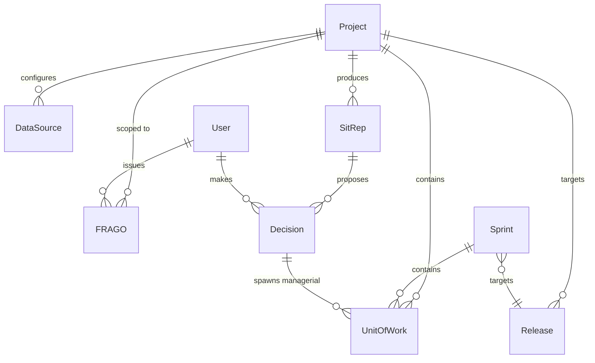
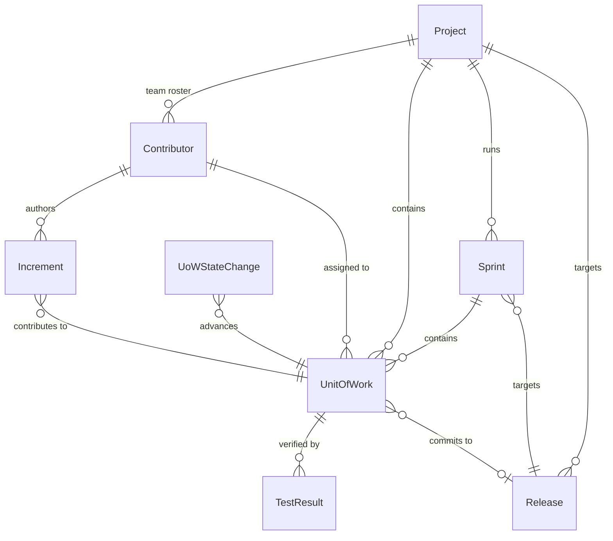
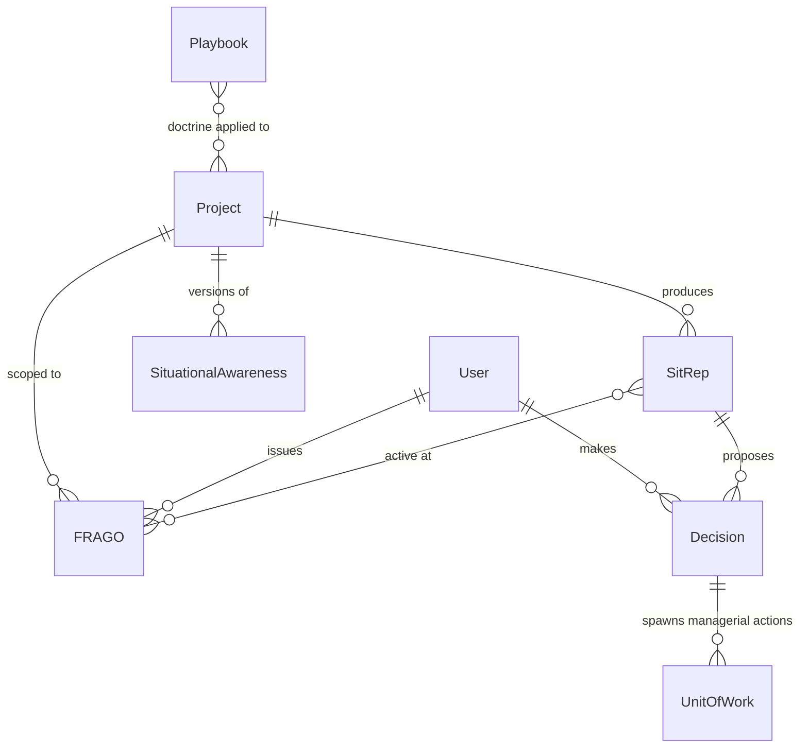
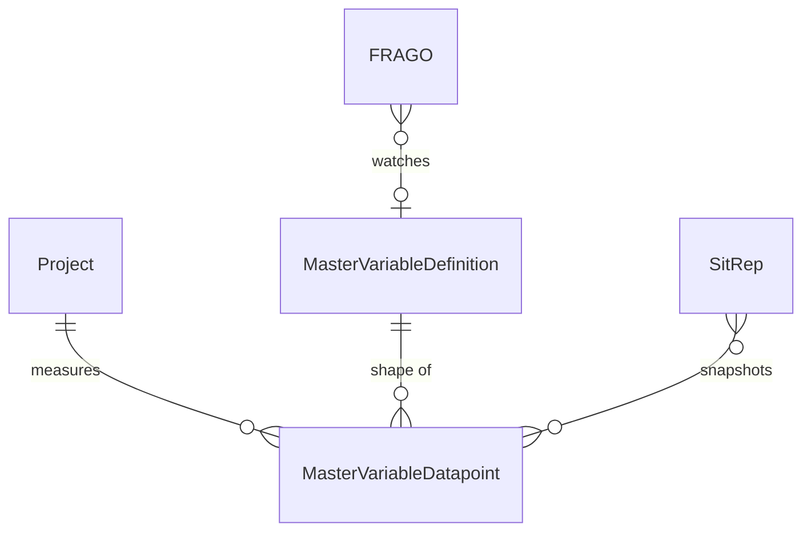
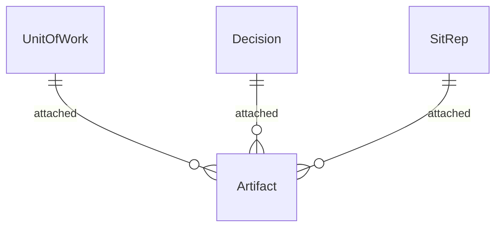
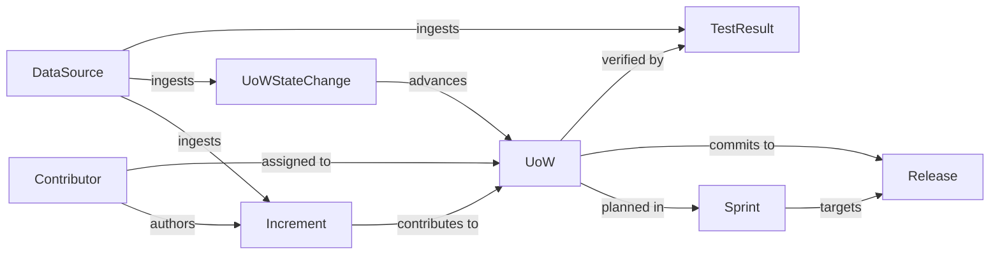

# The Composite: Huginn - Human-AI OODA for  PM

> *Saved from conversation — April 13, 2026*

---

## Seed: On Command and Composite Cognition

**Command as equation-solving:** Human + AI composite: identify the variables, solve the system, implement — ruthlessly or sneakily, whatever the topology of the problem demands. Boyd's OODA, Clausewitz's Schwerpunkt, implicit guidance and control — all variations of the same idea.

**The Composite framing** (Cheris/Jedao as archetype):
- Shared problem representation
- Asymmetric capabilities mapped to subproblems
- A trust/authority protocol that evolves as the mission unfolds
- Neither component can solve the problem alone — the composite is load-bearing

**Why do we need this? Loop tempo -> operation tempo: outthink the enemy**

The side cycling faster wins. The composite  multiplies your tempo giving you an advantage: find bottlenecs & design tasks to be handed to people/agents.

---

## Composite Cognition — Applied Science Foundation

**Distributed cognition** (Hutchins, *Cognition in the Wild*, 1995): cognition is distributed across people, artifacts, and representations. A navigation team isn't six people thinking — it's one cognitive system with six nodes.

**Extended mind theory** (Clark & Chalmers, 1998): cognitive processes can extend into tools. The boundary of "mind" is functional, not anatomical.

**Transactive memory systems** (Kozlowski et al.): high-performing teams don't share all knowledge — they share *knowledge about knowledge*, and route problems accordingly. Maps directly to human+AI composites.

**Empirical signal** (Noy & Zhang, MIT/QJE, 2023): AI assistance didn't just speed up writing — it changed cognitive strategy. Workers offloaded different parts of the problem than expected. That's cognitive restructuring, not tool use.

### Known failure modes
- **Automation bias** — humans over-trust AI under cognitive load; composite becomes less capable than either alone (Parasuraman & Manzey)
- **Skill atrophy** — AI consistently handling a subproblem causes human capability loss; composite degrades in ways neither component would alone
- **Representation mismatch** — human and AI solving slightly different problems because internal representations diverged; invisible until catastrophic

### What a well-functioning composite requires
- Shared problem representation — both nodes working on the same formulation
- Explicit uncertainty signaling — AI communicates confidence, not just answers
- Dynamic authority allocation — who leads on which subproblem shifts as the problem evolves
- Productive friction — a composite that never disagrees has silenced one node

---

## OODA Decomposition for the PM

### The decomposition

| Phase | Owner | Rationale |
|-------|-------|-----------|
| **O1 — Observe** | AI primary | Sensor fusion, pattern detection, recall without fatigue. Human doing first-O alone is slower and noisier. |
| **O2 — Orient** | Composite | Destruction and reconstruction of mental models. AI brings pattern libraries and consistency; human brings contextual judgment, stakes awareness, skin-in-the-game heuristics. |
| **D — Decide** | Human | Requires someone who bears the consequences. Fog is thickest here. Human judgment least replaceable. |
| **A-prep** | AI | Planning, dependency mapping, scenario modeling. |
| **A-exec** | Human | Execution is yours - create Jira issues for me in the managerial backlog. But AI observes in real time, feeds directly into next O1, including failure to act. |

---

## Personas

### Commander Donland — the PM running the loop

**Role**: Project Manager / Commander. Bears the consequences. Final call on Decisions.

**A day in the life**:

- **09:00 — AAR, 30-minute budget.** Opens Huginn and expects yesterday's After-Action Review already assembled: *who did what*, new **Issues** (active problems — e.g., "no burndown for 3 days"), new **Risks** (trending problems — e.g., "maintainability index has dropped for 4 consecutive sprints and is about to cross the acceptable threshold"). He uses the AAR to walk into standup with sharp questions that focus the team on risks, issues, and grey areas.
- **During the day — FRAGOs.** Drops ad-hoc standing orders for Huginn to watch on his behalf: *"keep an eye on the frequency of Anton's commits"*, *"if CI pipeline time exceeds 10 min, let me know"*. Each FRAGO is a persistent watcher with a triggering condition and a notification route, living until he revokes it.
- **All day — "Action Stations" is always in front of him.** Issues and Risks live in Jira as Tasks tagged `Issue` / `Risk`. Action Stations is the **synchronized Jira ↔ Huginn task list** — the same tasks, rendered in a PM-shaped surface. He annotates them with short status notes and attaches artifacts (PDFs with margin notes, extracts from chats, Confluence links); changes propagate back to Jira so there is one system of record. This is where he parks context between meetings and returns to it between fires.

**Implications for the product** (to carry into ESM):
- Primary landing surface is an **AAR / SitRep** view, not a generic dashboard.
- **FRAGO** is a first-class creatable Huginn entity with watcher semantics (condition + trigger + route), not a note.
- **Action Stations** is a synchronized view of the Jira task list, not a separate entity space. Screen ID likely `FOB-ACTIONS-LIST+FIND-1`, with a "mine / open / tagged Issue|Risk" default filter. Columns: Jira key, status, assignee, last annotation, attached artifacts.
- **Jira is the system of record** for Issues, Risks, and Actions. Huginn sync is bidirectional: it reads task state and tags, and writes Commander annotations and artifact links back as Jira comments / remote links.
- Cross-linking is load-bearing: PDFs, chat extracts, Confluence URLs, Jira keys, commits — all attachable to a task from Action Stations and surfaceable in the AAR.

---

## Key Entities

Huginn's domain is organized into four concerns: the **canonical work model** (what we analyze), **command & doctrine** (how we decide and act), **measurement & events** (what we observe), and **identity & configuration** (who and where).

**Ingestion principle**: the analytical layer operates on canonical types (`UnitOfWork`, `Release`, `Sprint`, `Increment`). Adapters translate source-system concepts at the edge:

- Jira Issue / GitLab Issue / GitHub Issue / Linear Ticket → **UnitOfWork**
- Jira Version / GitLab Milestone / GitHub Milestone → **Release**
- Jira Sprint / GitLab Iteration → **Sprint**

For synchronized surfaces (Action Stations), the upstream tool remains system of record. For analytics, the canonical projection is authoritative.

### Canonical Work Model

| Entity | Source of truth | Notes |
|--------|----------------|-------|
| **UnitOfWork** | Upstream tool (Jira etc.), mirrored | The atom of trackable work. Has a `backlog` attribute: `engineering` (flows to Release) or `managerial` (Actions spawned from Decisions). Tagged as `Issue` / `Risk` / `Action` when surfaced in Action Stations. |
| **Release** | Upstream tool, mirrored | The delivery target. UoWs flow through Sprints into a Release. |
| **Sprint** | Upstream tool, mirrored | Time-boxed cohort of UoWs within a Release. Burndown is computed here. |

### Command & Doctrine

| Entity | Source of truth | Notes |
|--------|----------------|-------|
| **SitRep / AAR** | Huginn | Generated snapshot of Master Variables + analysis + proposed Decisions. AAR is a time-scoped SitRep ("since yesterday"). Read-only once finalized. |
| **Decision** | Huginn | DA-loop primitive. Proposed by Gjallarhorn, accepted/rejected by Commander with rationale. **Accepting spawns one or more managerial UoWs.** Full history is the DA-loop log. |
| **FRAGO** | Huginn | Commander-issued standing watcher (condition + trigger + route). Lives until revoked. Triggered events can surface in the next SitRep or escalate into Decisions. |
| **SituationalAwareness** | Huginn | Durable narrative context carried across OODA passes. Versioned; updated in the DA write-back step. |
| **Playbook** | Huginn | Procedural knowledge (OO, DA). Doctrine-level, shared across Projects. Editable when new patterns emerge. |

### Measurement & Events (append-only)

| Entity | Source of truth | Notes |
|--------|----------------|-------|
| **UoWStateChange** | Huginn (ingested) | Transitions of a UoW (state, assignee, estimate, sprint). Each change *advances* the UoW through its lifecycle. Feeds cycle time, lead time, estimation drift. |
| **Increment** | Huginn (ingested) | A discrete contribution — commit, PR, review, doc update — attributed to a Contributor and linked to the UoW it advances. |
| **TestResult** | Huginn (ingested, XRay) | Red / green / gray; feeds Quality variable. Shown in the Canonical Work Model diagram (UoW ← verified by — TestResult) rather than Measurement, because the relationship is to the work item, not the Project aggregate. |
| **MasterVariableDatapoint** | Huginn (computed) | Snapshot of all Master Variables (Transparency, Throughput, Cycle/Lead Time, Rework, Quality, Complexity, Contribution) for a Project at time T. |

### Cross-cutting

| Entity | Source of truth | Notes |
|--------|----------------|-------|
| **Artifact** | Huginn (user-supplied or ingested) | PDFs, chat extracts, Confluence links, meeting notes. Attachable to UoWs, Decisions, and SitReps — spans all concerns. Cross-linking fabric. |

### Identity & Configuration

| Entity | Source of truth | Notes |
|--------|----------------|-------|
| **User** | Huginn | Huginn account. Roles: `Commander`, `Analyst` (TBD if distinct). |
| **Contributor** | Huginn (reconciled) | Developer identity unified across git author / Jira assignee / Slack handle. Derived profile: Pathfinder / Mastermind / Firefighter / Observer. |
| **Project** | Huginn config | The analysis scope: a repo (or set) + a Jira project + DataSources. One Project = one OODA cycle. |
| **DataSource** | Huginn config | Connection to GitLab / GitHub / Jira / Slack / Zoom / Confluence / XRay (credentials, endpoints, schedule). |
| **MasterVariableDefinition** | Huginn config | Formulas and thresholds per variable; FRAGOs may reference these. |

---

## Domain Model (Draft)

Read the **overview** first for the spine; then drill into the four focused views (each small enough to read without edge clutter).

### Overview

### Canonical Work Model

### Command & Doctrine

### Measurement

### Cross-cutting — Artifact Attachments

### Work Flow DAG

How work originates and flows toward Release as the delivery sink. Every path is directed and acyclic — Release has no outgoing edges. The two paths UoW→Sprint→Release and UoW→Release (direct fix-version) form a diamond, not a cycle.

**Open questions** (to resolve before ESM Activity 04 formalizes this):
1. **UoW ↔ Release**: can a UoW commit directly to a Release without going through a Sprint? (Assumed yes.)
2. **SitRep ↔ MasterVariableDatapoint**: does a SitRep *reference* the datapoints (shared, pointer) or *embed* them (snapshot copy)? Pointer is cheaper; embed is safer for reproducibility.
3. **Playbook scope**: global doctrine, or per-Project customizable fork? (Assumed global for now.)
4. **Notification / Alert**: when a FRAGO triggers, is the triggered event a first-class entity, or just a log line surfaced in the next SitRep?
5. **Contributor reconciliation**: identity unification across git/Jira/Slack is a known-hard problem. MVP assumes manual mapping table.
6. **Single-Project MVP?**: the model supports N Projects but MVP may hard-wire one. Affects navigation and scope picker.

---

## Data Foundation — What We Will Have

| Source | Signal type | Resolution |
|--------|------------|------------|
| GitLab/GitHub (no squash commits) | Work in progress, commit frequency, PR cycle time | Hours |
| Jira (issue-to-branch traceability) | Ticket state, flow efficiency, estimation drift | Daily |
| FastMCP wrapper | AI-queryable interface to Huginn | Real-time |
| Messaging (eg emails/Slack messages etc.) | outstanding items, blockers, risks
| Zoom Notes | MFUs -> outstanding items, blockers, risks
| Custom Artifacts | whatever PDF/MD files we can NER-extract info from & fit into our
| Test State | from XRay: red/green/gray
| Coverage | command like tools/existing reports in the repo structure - does green from test state means we are good or it means we have few tests?
[ To be extended later]

## How do we read data
These are dimensions we analyze through the OODA cycle: codebase, backlog, production cycle, release, [infra] environment, UX (user experience), DX (developer experience).
There is a set of Master Variables [prelim] we assess as part of the OODA cycle:

TRANSPARENCY: do we know whats actually happening - do our systems contain enough fresh data to make decisions?
THROUGHPUT: WoW do we push more work or less, both as user-visible story points and hidden function-based complexity-adjusted pts?
CYCLE & LEAD TIME: WoW do we push units of work faster or slower? Because of engineering or no (cycle time for eng activities)?
REWORK: What % of what we are pushing is rework? What kind of rework - downstream fucked it up?
QUALITY: test success rate  & test coverage, number of Defects and "Mean Time to Evict"
COMPLEXITY: looking at the current project (lets assume 1 project is one repo; can be a collection of repos later) whats the maintanability index?
CONTRIBUTION: in terms of profile "Y for new code and X axis for churn in existing" who are pathfinders (new code mostly), masterminds (both new and churn - all over the system), firefighters (mostly churn existing codebase), observers (their contribution is too small to classify them eiether way)
[ To be extended later]

SitRep: momentary snapshot of the current values + AI performing first pass of analysis: hypothesi on why there are undesired deviations + suggested Actions to test hypothesi + Decisions to  make -> execute.

## Playbook: doing OO

0. Load Situational Awareness / latest SitRep / FRAGO / Risks & Issues - what we know from the previous OODA passes, things to watch for per commander's request etc.
1. Check transparency - how stale are updates on Jira issues & pushes? Stale (not today) - this is first thing to fix.
2. Reconstruct the flow: how Unit of Work travels into the Release. If we dont know - we need to fix it.
3. Then we operate on Sprints -> culminates in Release. Check - how burndown looks - is it burning down? or scope expanding? or there is no visible progress measured in closed stories?
4. First we check quality of reqs: too big (thats why likely there is no burn down). Bad -> we need to improve.
5. Then we assess quality of the pipeline. Unstable -> we need to fix.
6. Assess architecture readiness - are there things we are missing we need to implement stories? Missing -> we need to act on them.
[ etc - full list to cover variables]
In the end we produce SitRep ("how bad things are") with Decisions/Actions ("how set things straight").

## Playbook: doing DA
1. Take a sitrep for every aspect of the Master Variables (think "Project Status Report").
2. Read problematic areas & propose Decision(s) + Action(s): "I agree with your assessment, my decision is that we need Daily Increment pushed by every developer. We shall have a list of those who is listed among authors but haven't pushed anything today."
3. Commander accepts/rejects/dids his own explanations + extra Orders ("FRAGO: keep an eye on the Halstead volume - if it goes down let me know"). Huginn creates Issues & Risks for the Commander to act upon.
4. Collect content of the OODA cycle and perform write back: add to Playbook / update Situational Awareness / extend/add/drop FRAGO / save SitRep.

# Stack

> Full architectural decisions in `docs/architecture/SAO.md`.

1. **Data**: PostgreSQL + Django ORM. State history as append-only tables (no graph DB). Redis for Celery broker + cache.
2. **Application**: Docker Compose deployment — `web` (Django), `worker` (Celery), `beat` (Celery scheduler), `redis`, `db` (PostgreSQL).
    - Django apps: `ingestion/`, `analytics/`, `sitrep/`, `ui/`, `gjallarhorn/`
    - Extraction jobs (Celery Beat, hourly) pull data from GitLab (`python-gitlab`), Jira (`jira`) — further sources TBD
    - Gjallarhorn AI assesses situation per OO → SitRep (FastMCP interface)
    - Django + HTMX + Apache ECharts for the PM dashboard and DA chat
    - Configuration (API tokens etc.) externalized as env vars
3. **Deploy**: AWS Elastic Beanstalk + GitLab Pipelines. Docker Compose in prod.
