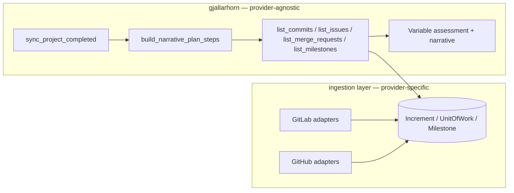
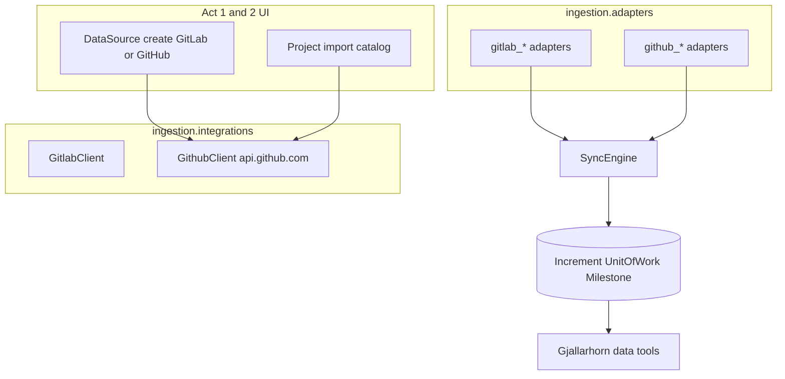

# GitHub DataSource — BPE-01 Plan Feature

Companion to [`.cursor/workflows/BPE-reference/BPE-reference-01-Plan_Feature.md`](.cursor/workflows/BPE-reference/BPE-reference-01-Plan_Feature.md).

**BPE-01 step coverage (this session):**

| Step | Status |
|------|--------|
| 0 Reset | N/A (greenfield plan) |
| 1 SAO | Read [`docs/architecture/SAO.md`](docs/architecture/SAO.md) §1, §4, §5, §17 |
| 2 User Journey | Read [`docs/features/user_journey.md`](docs/features/user_journey.md) Acts 1–2, 5, 8 |
| 3 Feature spec | **Proposed** new Act 9 feature file (Phase A deliverable) |
| 4 Codebase assessment | GitLab path is production-ready; GitHub is absent |
| 5 Clarifications | **GitHub.com only** for MVP (`api.github.com` hardcoded; no GHE base URL) |
| 6 Plan | This document |
| 7 Rule refs | See per-scenario notes |
| 8 No estimates | Omitted |
| 9 Submit for approval | **Stop here — no code, no GitLab issues until approved** |
| 10 Issue management | Phase B after approval (GitLab tracker per repo convention) |

**Naming note:** Planning and SitRep execution run through **Gjallarhorn** (`gjallarhorn/`), not "Galdr". There is no `Galdr` module in this repo.

---

## Why (vision + journey)

- [`docs/ideation/vision.md`](docs/ideation/vision.md) already defines canonical mapping: GitHub Issue → `UnitOfWork`, GitHub Milestone → `Milestone`, GitHub PR → `UnitOfWork` (same as GitLab MR).
- [`docs/features/user_journey.md`](docs/features/user_journey.md) Act 1 today says "MVP supports GitLab"; Act 2 import is GitLab-only in code. Commander should pick **GitLab or GitHub** at datasource create, then import repos/projects from either.
- **Product contract:** behaviour identical to GitLab (sync cadence, Increments tab, SitRep pipeline, Variables) except **Tactical Plot / card datasource icon** shows GitHub (`simpleicons.org/github`) vs GitLab.

---

## Gjallarhorn planning — dual-provider contract (critical)

Gjallarhorn does **not** call GitLab or GitHub live during SitRep. The architecture is already provider-agnostic:



**What stays unchanged for both providers:**

- [`gjallarhorn/services/sitrep_service.py`](gjallarhorn/services/sitrep_service.py) `build_narrative_plan_steps()` — fixed 7 data-collection steps + N variable steps + 1 narrative step
- [`gjallarhorn/mcp_tools/data_tools.py`](gjallarhorn/mcp_tools/data_tools.py) — tools query **canonical ORM** only
- [`gjallarhorn/tasks/sitrep_tasks.py`](gjallarhorn/tasks/sitrep_tasks.py) → [`gjallarhorn/tasks/plan_tasks.py`](gjallarhorn/tasks/plan_tasks.py) execution loop
- GitHub PRs stored as `UnitOfWork.kind = merge_request` so step 7 (`list_merge_requests`) works without a new tool

**What we must fix while adding GitHub:**

| Location | Today | Change |
|----------|-------|--------|
| [`ingestion/services/sync_engine.py`](ingestion/services/sync_engine.py) ~281 | `UoWStateChange.source="gitlab"` hardcoded | Set `source=project.datasource.datasource_type` |
| [`ingestion/adapters/gitlab_common.py`](ingestion/adapters/gitlab_common.py) | `contributor_from_user(..., source="gitlab")` | Pass datasource type through adapters |
| [`gjallarhorn/services/sitrep_service.py`](gjallarhorn/services/sitrep_service.py) step copy | "ingested GitLab issues" | Provider-neutral wording ("ingested issues") |
| [`ingestion/services/project_metadata.py`](ingestion/services/project_metadata.py) | GitLab-only refresh | Add GitHub branch using `GithubClient.get_repo()` |

**No new Gjallarhorn tools required** if GitHub sync populates the same canonical tables before `generate_sitrep_for_project` runs.

**Validation scenario (S8):** import a GitHub repo, run full sync with mocked HTTP in unit/integration tests, then `generate_sitrep_for_project` → assert steps 1–7 succeed and step 5–7 results contain GitHub-sourced rows — same assertion shape as [`docs/features/act-8-gitlab-work-items/gitlab-work-ingestion.feature`](docs/features/act-8-gitlab-work-items/gitlab-work-ingestion.feature) S6.

---

## Context Map

| File | Lines | Note |
|------|-------|------|
| [`ingestion/models/__init__.py`](ingestion/models/__init__.py) | 12–195 | Add `Type.GITHUB`; generalize `gitlab_project_id` → `external_project_id` |
| [`ingestion/adapters/__init__.py`](ingestion/adapters/__init__.py) | 1–36 | Register GitHub adapters alongside GitLab — do NOT change registry API |
| [`ingestion/adapters/gitlab_commits.py`](ingestion/adapters/gitlab_commits.py) | 1–120 | Mirror adapter + `register_adapter` pattern for `github_commits.py` |
| [`ingestion/integrations/gitlab_client.py`](ingestion/integrations/gitlab_client.py) | 1–80 | Mirror urllib client style for `github_client.py` (Bearer auth, Link pagination) |
| [`ingestion/services/sync_engine.py`](ingestion/services/sync_engine.py) | 118–166 | Already type-agnostic — only fix hardcoded `source` |
| [`ui/services/datasources_service.py`](ui/services/datasources_service.py) | 26–99 | Add `test_github_connection` / `create_github_source` parallel to GitLab |
| [`ui/services/projects_service.py`](ui/services/projects_service.py) | 45–80 | Branch catalog load on `datasource_type`; GitHub key = repo `id` string |
| [`ui/views/dashboard.py`](ui/views/dashboard.py) | 28–53 | Add GitHub to `_DS_SOURCE_META` for plot icon |
| [`gjallarhorn/services/sitrep_service.py`](gjallarhorn/services/sitrep_service.py) | 71–115 | Plan template — copy-only tweak, no structural change |
| [`tests/integration/test_projects_import.py`](tests/integration/test_projects_import.py) | 1–80 | Fixture pattern for GitHub import integration tests |

---

## Do Not Do

- Do NOT create a new Django app — extend [`ingestion/`](ingestion/) and [`ui/`](ui/) only
- Do NOT add a manager/repository layer — `SyncEngine` and services call ORM directly (SAO §1)
- Do NOT add async — Celery + synchronous ORM throughout
- Do NOT call GitHub live from `gjallarhorn/` — tools read ingested ORM rows only (same contract as GitLab)
- Do NOT add GitHub Enterprise Server support in MVP — hardcode `https://api.github.com` as API base
- Do NOT introduce provider-specific SitRep plan steps or new MCP tools for GitHub
- Do NOT store GitHub PRs as `Increment` — map to `UnitOfWork.kind=merge_request`
- Do NOT use `'amber'` for traffic-light colors — keep `'orange'`
- Do NOT mock Django/ORM in integration tests — use `responses` for GitHub HTTP in unit client/adapter tests only
- Do NOT edit frozen mockup templates under `ui/templates/ui/mockups/` for operational behaviour

---

## SAO.md Sections That Apply

- **§1 Application Blocks & dependency rules** — ingestion owns connectors/adapters; `gjallarhorn/` reads canonical models; `ui/` services delegate to `ingestion.integrations`
- **§4 Data Architecture** — append-only `UoWStateChange`; upsert on `(project, kind, external_id)` / `(project, external_id)` for milestones
- **§5 Test Strategy** — `responses` for external HTTP; integration tests use real DB + factories
- **§17.6 Token economy** — SitRep data steps remain deterministic tool calls (no extra LLM calls)
- **§17.7 SitRep generation flow** — 7 data-collection steps unchanged; provider parity is an ingestion prerequisite

---

## Architecture



**GitHub → canonical mapping (mirrors GitLab):**

| GitHub API | Canonical model | Notes |
|------------|-----------------|-------|
| Commit | `Increment` kind `commit` | Paginate `/repos/{owner}/{repo}/commits` |
| Issue | `UnitOfWork` kind `issue` | Filter out rows with `pull_request` key |
| Pull Request | `UnitOfWork` kind `merge_request` | `/pulls` endpoint |
| Milestone | `Milestone` | `/milestones` |

**Model generalization:**

- Rename `Project.gitlab_project_id` → `Project.external_project_id` (`BigIntegerField`, nullable) — holds GitLab project id or GitHub repo id (both numeric)
- Use existing `Project.source_path` for GitHub as `owner/repo` (API path segment)
- Update unique constraint: `(datasource, external_project_id)` when not null
- Data migration copies existing `gitlab_project_id` values

**GitHub.com MVP client surface** ([`ingestion/integrations/github_client.py`](ingestion/integrations/github_client.py)):

- Auth: `Authorization: Bearer {token}` + `Accept: application/vnd.github+json`
- `verify_token()` → `GET /user`
- `get_visible_repo_count()` → `GET /user/repos?per_page=1` + `Link` header / total heuristic
- `list_visible_repos()` → paginated user repos (affiliation filter: owner, collaborator)
- `get_repo(owner, repo)` → metadata refresh
- `list_commits`, `list_issues`, `list_pull_requests`, `list_milestones` — mirror GitLab client method shapes returning normalized dicts

**Required PAT scopes (document in UI help text):** `repo` (or fine-grained: Contents read, Issues read, Pull requests read, Metadata read).

---

## Phase A — Documentation package (present for approval)

Deliverables — **no application code**:

1. **New feature file** [`docs/features/act-9-github-ingestion/github-ingestion.feature`](docs/features/act-9-github-ingestion/github-ingestion.feature) — 8 scenarios below
2. **This plan** saved as [`docs/plans/GITHUB_DATASOURCE_BPE01_IMPLEMENTATION_PLAN.md`](docs/plans/GITHUB_DATASOURCE_BPE01_IMPLEMENTATION_PLAN.md)
3. **Journey cross-link** — update Act 1 bullet in [`docs/features/user_journey.md`](docs/features/user_journey.md): "MVP supports GitLab **and GitHub**"
4. **Optional:** extend [`docs/features/act-1-datasources/datasources-create.feature`](docs/features/act-1-datasources/datasources-create.feature) scenario for GitHub card (or keep scenarios solely in Act 9)

**Approval checkpoint:** Commander reviews feature file + plan. Explicit "approved" before Phase B.

---

## Feature scenarios (Phase A artifact)

| ID | Scenario | Proves |
|----|----------|--------|
| S1 | DataSource create — GitHub type card selectable; test + save | Act 1 parity |
| S2 | DataSource list/filter shows GitHub type | Act 1 |
| S3 | Project import loads GitHub repos from connected source | Act 2 |
| S4 | Import creates Project with `external_project_id`, `source_path=owner/repo`, queues sync | Act 2 |
| S5 | Sync ingests commits, issues, PRs, milestones into canonical models | Ingestion |
| S6 | Reopened GitHub issue appends `UoWStateChange` with `source=github` | State history |
| S7 | SitRep plan still has 7 data-collection steps; tools return GitHub-ingested rows | Gjallarhorn contract |
| S8 | Full SitRep pipeline e2e with GitHub project (ingest → generate → VariableDatapoints) | End-to-end |

Each scenario: 5–10 Gherkin steps, independently testable, concrete examples.

---

## Phase B — GitLab milestone + tracking issues (after approval)

Milestone: **GitHub DataSource & Ingestion** on `dp2580/huginn`.

Create **8 issues** (S1–S8). Each body inlines per BPE-01 Step 10:

- `<!-- SCENARIO -->` block with `id`, `checkpoint.command`, `sao_sections`, `do_not_do`
- Full Context Map, Do Not Do, SAO sections (not links)
- Scenario-specific implementation slice
- Acceptance: checkpoint pytest green + `pytest tests/ -x` no regressions

Issue bodies mirror prior Acts under `docs/plans/.gitlab-issue-bodies/GH*.md`.

| Issue | Checkpoint |
|-------|------------|
| S1 Model + migration | `pytest tests/unit/test_project_external_id_migration.py tests/unit/test_datasource_model.py -x -q` |
| S2 GitHub client | `pytest tests/unit/test_github_client.py -x -q` |
| S3 DataSource UI/service | `pytest tests/integration/test_datasources_create_github.py tests/integration/test_datasources_edit_github.py -x -q` |
| S4 Project import | `pytest tests/integration/test_projects_import_github.py -x -q` |
| S5 Commit adapter | `pytest tests/unit/test_github_commit_adapter.py -x -q` |
| S6 Work-item adapters + sync | `pytest tests/integration/test_sync_engine_github_e2e.py -x -q` |
| S7 Gjallarhorn + plot icon | `pytest tests/gjallarhorn/test_sitrep_service_steps.py tests/integration/test_github_sitrep_pipeline_e2e.py tests/integration/test_dashboard_github_icon.py -x -q` |
| S8 Journey certification | `pytest tests/ -x -q` (full suite gate) |

Prefix titles: `Act 9 GitHub — S1 … S8`. Labels: `Feature`, `easy`/`medium`.

---

## Phase C — Implementation (by scenario)

### Branch

```bash
git checkout -b feature/github-datasource-ingestion
```

### S1 — Model + migration

- Add `DataSource.Type.GITHUB = "github", "GitHub"`
- Rename `gitlab_project_id` → `external_project_id`; migration + data copy
- Update all references (adapters, services, factories, tests)
- Add `ingestion/apps.py` imports for future GitHub adapter modules (empty until S5/S6)

### S2 — GitHub client

- New [`ingestion/integrations/github_client.py`](ingestion/integrations/github_client.py)
- `_paginate` via `Link: <url>; rel="next"` headers
- Unit tests with `responses` — 401/404/network cases mirror GitLab client tests

### S3 — DataSource create/edit/test (UI)

- [`ui/templates/ui/datasources/create.html`](ui/templates/ui/datasources/create.html): enable GitHub card (`fa-github`); Jira stays disabled
- [`ui/views/datasources.py`](ui/views/datasources.py): route step-2 by type; GitHub uses fixed API base (hidden field or constant)
- [`ui/services/datasources_service.py`](ui/services/datasources_service.py): `test_github_connection`, `create_github_source`, `update_github_source`
- Edit/view/list: show GitHub type badge; test connection works for GitHub rows
- [`static/js/datasource_form.js`](static/js/datasource_form.js): no base URL edit needed for GitHub if hardcoded — show read-only "GitHub.com" label

### S4 — Project import

- [`ui/views/projects.py`](ui/views/projects.py): `_connected_datasources()` includes GitHub Connected sources (not GitLab-only)
- [`ui/services/projects_service.py`](ui/services/projects_service.py): `load_remote_projects_snapshot` branches on type; GitHub catalog columns match GitLab (name, full_name, description, updated_at)
- `persist_imported_project_selection`: set `external_project_id`, `source_path=full_name`, slug from repo name
- Dedup via `(datasource, external_project_id)`

### S5 — Commit adapter

- [`ingestion/adapters/github_commits.py`](ingestion/adapters/github_commits.py) + [`ingestion/adapters/github_common.py`](ingestion/adapters/github_common.py)
- `register_adapter(DataSource.Type.GITHUB, GithubCommitAdapter)`
- Map GitHub commit SHA → `IncrementDTO`; contributor from `commit.author` / `commit.committer`

### S6 — Work-item adapters + sync fixes

- `github_issues.py`, `github_pull_requests.py`, `github_milestones.py`
- Register work + milestone adapters for `GITHUB`
- Refactor GitLab adapters to use `external_project_id` + shared helper `remote_ref_for(project)` returning `(gitlab_id)` or `(owner, repo)`
- Fix `sync_engine` `UoWStateChange.source` to use datasource type
- [`ingestion/services/project_metadata.py`](ingestion/services/project_metadata.py): GitHub description/name refresh

### S7 — Gjallarhorn validation + Tactical Plot icon

- Provider-neutral copy in `sitrep_service.py`
- [`ui/views/dashboard.py`](ui/views/dashboard.py): `_DS_SOURCE_META[DataSource.Type.GITHUB] = {"key": "github", "label": "GitHub", "si_slug": "github"}`
- Integration test: GitHub project card renders `simpleicons.org/github` icon
- `test_sitrep_service_steps.py`: unchanged step count/order
- `test_github_sitrep_pipeline_e2e.py`: mirrors GitLab work-items S6

### S8 — Regression gate

- Full `pytest tests/ -x`
- Update any Act 1/2 integration tests that assume GitLab-only import filter

---

## UI parity checklist (GitLab vs GitHub)

| Surface | GitLab today | GitHub target |
|---------|--------------|---------------|
| DataSource create step 1 | GitLab + Jira (disabled) | GitLab + **GitHub** + Jira (disabled) |
| DataSource list type filter | GitLab / Jira | GitLab / **GitHub** / Jira |
| Project import datasource dropdown | Connected GitLab only | Connected **GitLab or GitHub** |
| Project Vitals Identity | source path + URL | Same |
| Increments tab | commit rows from sync | Same (provider-agnostic) |
| Sync now / beat | `sync_project` | Same task, adapters by type |
| Tactical Plot icon | `simpleicons.org/gitlab` | `simpleicons.org/github` |
| SitRep / Variables / Chat | canonical data | Unchanged |

---

## Open items deferred (post-MVP)

- GitHub Enterprise Server (custom API base URL)
- GitHub App / OAuth install flow (PAT-only for MVP, same as GitLab)
- Separate `UnitOfWork.Kind.PULL_REQUEST` vs reusing `merge_request`
- Provider badge on Projects list row (optional; plot icon is the stated differentiator)
