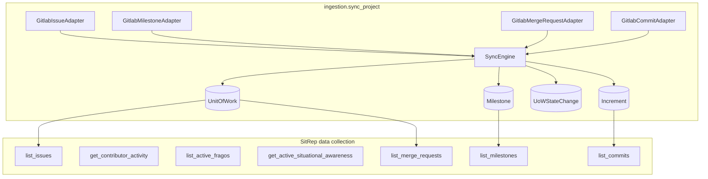

# GitLab Issues, Milestones, and MRs — Implementation Plan

**BPE-01 Plan Feature** · canonical doc for Act 8 GitLab work-item ingestion

---

## Execution order (gates)

| Phase | What | Gate |
|-------|------|------|
| **A — Docs** | Feature file + implementation plan in `docs/` | **Human approval required** — stop here; no GitLab issues, no code |
| **B — Tracking** | GitLab milestone + 6 scenario issues (inline Context Map, Do Not Do, SAO, checkpoint) | Only after Phase A approved |
| **C — Build** | S1 → S6 implementation on `feature/gitlab-work-items-ingestion` | Only after Phase B issues exist |

BPE-01 Step 9: present Phase A artifacts for review. Step 10 (GitLab issues) runs in Phase B, not before approval.

---

**Why (vision + journey):**
- [`docs/ideation/vision.md`](docs/ideation/vision.md): Variables like **Cycle & Lead Time**, **Rework**, and **Transparency** need **UnitOfWork** lifecycle + **Milestone** burndown—not commit proxies alone. OO procedure steps 2–3 explicitly reconstruct *UoW → Milestone* flow.
- [`docs/features/user_journey.md`](docs/features/user_journey.md): SitRep `ExecutionPlan` step 1 is data collection before per-Variable LLM assessment; today only commits/FRAGOs/SA are collected while prompts claim issues/MRs exist ([`gjallarhorn/agent/prompts.py`](gjallarhorn/agent/prompts.py)).
- **Scope confirmed:** ingestion + Gjallarhorn tools + SitRep steps **only** (no new Project tabs). **MRs map to `UnitOfWork`** with a kind discriminator (same table as GitLab Issues).

---

## Context Map

| File | Lines | Note |
|------|-------|------|
| [`ingestion/adapters/gitlab_commits.py`](ingestion/adapters/gitlab_commits.py) | 1–120 | Follow adapter + `register_adapter(DataSource.Type.GITLAB, …)` pattern for new GitLab adapters |
| [`ingestion/services/sync_engine.py`](ingestion/services/sync_engine.py) | 90–154 | Extend `_execute_run` to persist work + milestone DTOs alongside `IncrementDTO` |
| [`ingestion/integrations/gitlab_client.py`](ingestion/integrations/gitlab_client.py) | 1–253 | Extend urllib client with paginated issues/milestones/MRs (same style as `list_commits`) |
| [`ingestion/models/__init__.py`](ingestion/models/__init__.py) | 189–247 | Add `UnitOfWork`, `Milestone`, `UoWStateChange` next to `Increment`; follow FK/index conventions |
| [`gjallarhorn/mcp_tools/data_tools.py`](gjallarhorn/mcp_tools/data_tools.py) | 1–45 | Add `list_issues`, `list_milestones`, `list_merge_requests` querying local ORM (mirror `list_commits`) |
| [`gjallarhorn/services/sitrep_service.py`](gjallarhorn/services/sitrep_service.py) | 71–115 | Insert steps 5–7 (issues, milestones, MRs) before Variable assessment steps; renumber orders |
| [`gjallarhorn/services/factory.py`](gjallarhorn/services/factory.py) | 39–47 | Register the three new tools on `ToolExecutor` |
| [`gjallarhorn/agent/agent.py`](gjallarhorn/agent/agent.py) | 251–257 | Extend `_resolve_tool_kwargs` for time-window tools |
| [`tests/unit/test_gitlab_commit_adapter.py`](tests/unit/test_gitlab_commit_adapter.py) | 1–80 | Fixture + `responses` HTTP mocking pattern for new adapter tests |

---

## Do Not Do

- Do NOT create a new Django app — extend [`ingestion/`](ingestion/) only
- Do NOT add a manager/repository layer — `SyncEngine` and tools call ORM directly
- Do NOT add async — Celery + synchronous ORM throughout
- Do NOT build Project UI tabs in this iteration (Issues/Milestones/MRs views deferred)
- Do NOT call GitLab live from `gjallarhorn/` — tools read ingested ORM rows only (same contract as `list_commits`)
- Do NOT store MRs as `Increment` kind — user chose **UnitOfWork** for MRs
- Do NOT introduce `Sprint` or `Release` models in this iteration
- Do NOT change existing `DataSourceAdapter.fetch_increments` signature — add parallel adapter ABCs
- Do NOT use `'amber'` for traffic-light colors — keep `'orange'`
- Do NOT mock Django/ORM in integration tests — use `responses` only for GitLab HTTP in **unit** client/adapter tests (S2/S4); S6 runs the real application stack

---

## SAO.md Sections That Apply

- **§1 Application Blocks & dependency rules** — work models live in `ingestion/`; `gjallarhorn/` reads them; `sitrep/` unchanged except consuming richer collected data
- **§4 Data Architecture** — append-only `UoWStateChange`; expand-contract migrations; upsert on `(project, external_id)`
- **§5 Test Strategy** — `responses` for GitLab HTTP; integration tests use real DB + factories
- **§17.6 Token economy** — new steps are deterministic tool calls (no extra LLM calls); intra-plan tool cache applies
- **§17.7 SitRep generation flow** — extend data-collection phase from 4 → **7** steps before Variable assessment

---

## Architecture



**Canonical mapping (GitLab → Huginn):**

| GitLab API | Canonical model | `UnitOfWork.kind` / notes |
|------------|-----------------|---------------------------|
| Issue | `UnitOfWork` | `issue` |
| Merge Request | `UnitOfWork` | `merge_request` |
| Milestone | `Milestone` | UoWs link via FK |

---

## Phase A — Documentation package (present for approval)

Deliverables (no application code in this phase):

1. [`docs/features/act-8-gitlab-work-items/gitlab-work-ingestion.feature`](docs/features/act-8-gitlab-work-items/gitlab-work-ingestion.feature) — **6 scenarios** (5–10 steps each)
2. [`docs/plans/GITLAB_WORK_ITEMS_IMPLEMENTATION_PLAN.md`](docs/plans/GITLAB_WORK_ITEMS_IMPLEMENTATION_PLAN.md) — this plan (Context Map, Do Not Do, SAO sections, S1–S6 steps, checkpoints)
3. Optional: brief Act 8 pointer in [`docs/features/user_journey.md`](docs/features/user_journey.md) ingestion note (only if product wants journey cross-link)

**Approval checkpoint:** Commander reviews feature file + plan MD. Explicit “approved” before Phase B.

---

## Feature scenarios (Phase A artifact)

Add [`docs/features/act-8-gitlab-work-items/gitlab-work-ingestion.feature`](docs/features/act-8-gitlab-work-items/gitlab-work-ingestion.feature) with **6 scenarios** (5–10 steps each):

| ID | Scenario | Proves |
|----|----------|--------|
| S1 | Sync ingests GitLab issues as UnitOfWork | Issue adapter + persistence |
| S2 | Sync ingests GitLab milestones | Milestone adapter |
| S3 | Sync ingests GitLab MRs as UnitOfWork kind merge_request | MR adapter |
| S4 | State change append on issue reopen | UoWStateChange |
| S5 | SitRep plan includes 7 data-collection steps | `build_narrative_plan_steps` |
| S6 | Full SitRep pipeline with ingested issues/MRs/milestones | Real `generate_sitrep_for_project` → `execute_plan` → tools → LLM → `VariableDatapoint` (no GUI, no app mocks) |

---

## Phase B — GitLab milestone + tracking issues (after approval)

Milestone: **GitLab work items for Variables** on `dp2580/huginn`.

Create **6 issues** (S1–S6). Each body inlines per BPE-01 Step 10:
- `<!-- SCENARIO -->` block with `id`, `checkpoint.command`, `sao_sections`, `do_not_do`
- Full Context Map, Do Not Do, SAO sections, scenario-specific plan slice
- Acceptance: checkpoint pytest green + `pytest tests/ -x` no regressions

Prefix titles: `Act 8 Work Items — S1 … S6`. Labels: `Feature`, `easy`/`medium`.

| Issue | Checkpoint |
|-------|------------|
| S1 Models | `pytest tests/unit/test_unit_of_work_model.py tests/unit/test_milestone_model.py -x -q` |
| S2 Client | `pytest tests/unit/test_gitlab_client_work_items.py -x -q` |
| S3 SyncEngine | `pytest tests/unit/test_sync_engine_work_items.py -x -q` |
| S4 Adapters | `pytest tests/integration/test_sync_engine_work_items_e2e.py -x -q` |
| S5 Tools + plan | `pytest tests/gjallarhorn/test_data_tools_work_items.py tests/gjallarhorn/test_sitrep_service_steps.py -x -q` |
| S6 E2E pipeline | `pytest tests/integration/test_work_items_pipeline_e2e.py -x -q` *(requires `ANTHROPIC_API_KEY`; skipped in CI without key)* |

Issue bodies live under `docs/plans/.gitlab-issue-bodies/` (mirror prior Acts). **Do not create issues until Phase A is approved.**

---

## Phase C — Implementation (by scenario)

### Branch

```bash
git checkout -b feature/gitlab-work-items-ingestion
```

---

### S1 — Canonical work models

**Models** in [`ingestion/models/__init__.py`](ingestion/models/__init__.py):

```python
class Milestone(Model):
    project, datasource, external_id, title, state, due_date, start_date,
    updated_at, payload JSON; UniqueConstraint(project, external_id)

class UnitOfWork(Model):
    class Kind: ISSUE = "issue"; MERGE_REQUEST = "merge_request"
    project, datasource, kind, external_id, iid, title, state,
    milestone FK nullable, assignee FK Contributor nullable,
    labels JSON, created_at, updated_at, closed_at nullable,
    payload JSON; UniqueConstraint(project, kind, external_id)

class UoWStateChange(Model):
    unit_of_work FK, from_state, to_state, recorded_at, source default "gitlab"
    # index (unit_of_work, recorded_at)
```

- Register in [`ingestion/admin.py`](ingestion/admin.py)
- Factories in [`tests/factories.py`](tests/factories.py): `MilestoneFactory`, `UnitOfWorkFactory`, `UoWStateChangeFactory`

**Tests** [`tests/unit/test_unit_of_work_model.py`](tests/unit/test_unit_of_work_model.py), [`tests/unit/test_milestone_model.py`](tests/unit/test_milestone_model.py):
- Unique constraints per `(project, kind, external_id)` and `(project, external_id)` for milestones
- `UoWStateChange` append-only create

**Checkpoint:** `pytest tests/unit/test_unit_of_work_model.py tests/unit/test_milestone_model.py -x -q`

**Commit:** `feat(ingestion): add UnitOfWork Milestone and UoWStateChange models`

---

### S2 — Domain DTOs + GitLab client

**New** [`ingestion/domain/work.py`](ingestion/domain/work.py):
- `UnitOfWorkDTO`, `MilestoneDTO` dataclasses (frozen, no Django imports)
- `stable_key()` helpers for upsert identity

**Extend** [`ingestion/integrations/gitlab_client.py`](ingestion/integrations/gitlab_client.py):
- `list_issues(project_id, *, updated_after=None, state=None, per_page=100)`
- `list_milestones(project_id, *, updated_after=None)`
- `list_merge_requests(project_id, *, updated_after=None, state=None)`
- Use GitLab REST v4 pagination (`X-Next-Page`) like existing `list_commits`

**Tests** [`tests/unit/test_gitlab_client_work_items.py`](tests/unit/test_gitlab_client_work_items.py) with `responses`:
- Pagination, `updated_after` query param, error handling (401/404)

**Checkpoint:** `pytest tests/unit/test_gitlab_client_work_items.py -x -q`

**Commit:** `feat(ingestion): GitLab client methods for issues milestones MRs`

---

### S3 — Adapter ABCs + SyncEngine extension

**Extend** [`ingestion/adapters/base.py`](ingestion/adapters/base.py):

```python
class WorkItemAdapter(ABC):
    def fetch_work_items(self, project, *, since) -> Iterable[UnitOfWorkDTO]: ...

class MilestoneAdapter(ABC):
    def fetch_milestones(self, project, *, since) -> Iterable[MilestoneDTO]: ...
```

**Extend** [`ingestion/adapters/__init__.py`](ingestion/adapters/__init__.py):
- `WORK_ADAPTER_REGISTRY`, `MILESTONE_ADAPTER_REGISTRY` (parallel to increment registry)
- `work_adapter_classes_for()`, `milestone_adapter_classes_for()`

**Extend** [`ingestion/services/sync_engine.py`](ingestion/services/sync_engine.py):
- After increment loop, run work + milestone adapters
- `_persist_work_dto`: upsert `Milestone` first (if referenced), then `UnitOfWork`; compare prior `state` → append `UoWStateChange` when changed
- Optionally extend `IngestionRun` with `work_items_ingested` / `milestones_ingested` counters (migration)

**Tests** [`tests/unit/test_sync_engine_work_items.py`](tests/unit/test_sync_engine_work_items.py):
- Fake adapters yield DTOs; assert ORM rows + state change on reopen
- Idempotent re-sync (same external_id updates, no duplicate state rows if unchanged)

**Checkpoint:** `pytest tests/unit/test_sync_engine_work_items.py -x -q`

**Commit:** `feat(ingestion): SyncEngine persists UnitOfWork and Milestone DTOs`

---

### S4 — GitLab adapters (Issues, Milestones, MRs)

**New files** (register on import via [`ingestion/apps.py`](ingestion/apps.py)):

| Adapter | File | Maps |
|---------|------|------|
| Issues | [`ingestion/adapters/gitlab_issues.py`](ingestion/adapters/gitlab_issues.py) | GitLab issue → `UnitOfWorkDTO(kind=issue)` |
| Milestones | [`ingestion/adapters/gitlab_milestones.py`](ingestion/adapters/gitlab_milestones.py) | GitLab milestone → `MilestoneDTO` |
| MRs | [`ingestion/adapters/gitlab_merge_requests.py`](ingestion/adapters/gitlab_merge_requests.py) | GitLab MR → `UnitOfWorkDTO(kind=merge_request)` |

Field mapping essentials:
- **Issue:** `id` → external_id, `iid`, `title`, `state`, `labels`, `assignee` → ContributorDTO, `milestone.id` → milestone external ref, `created_at`/`updated_at`/`closed_at`
- **Milestone:** `id`, `title`, `state`, `due_date`, `start_date`, `updated_at`
- **MR:** `id`, `iid`, `title`, `state`, `merged_at`/`closed_at`, author → ContributorDTO, `target_branch`/`source_branch` in payload

**Integration E2E** [`tests/integration/test_sync_engine_work_items_e2e.py`](tests/integration/test_sync_engine_work_items_e2e.py):
- `responses` mock all three GitLab list endpoints + commits
- Run `SyncEngine().run_for_project()` → assert counts on `UnitOfWork`, `Milestone`, `UoWStateChange`

**Checkpoint:** `pytest tests/integration/test_sync_engine_work_items_e2e.py -x -q`

**Commit:** `feat(ingestion): GitLab adapters for issues milestones and merge requests`

---

### S5 — Gjallarhorn tools + SitRep plan steps

**Extend** [`gjallarhorn/mcp_tools/data_tools.py`](gjallarhorn/mcp_tools/data_tools.py):

```python
def list_issues(project_id, from_dt, to_dt, limit=200) -> list[dict]:
    # UnitOfWork kind=issue, filter updated_at or closed_at in window

def list_merge_requests(project_id, from_dt, to_dt, limit=200) -> list[dict]:
    # UnitOfWork kind=merge_request

def list_milestones(project_id, at_dt=None, limit=50) -> list[dict]:
    # Active + recently closed milestones relevant to project
```

Return compact dicts (id, iid, title, state, milestone_title, assignee, labels, updated_at, closed_at, web_url from payload).

**Register** in [`gjallarhorn/services/factory.py`](gjallarhorn/services/factory.py).

**Extend** [`gjallarhorn/services/sitrep_service.py`](gjallarhorn/services/sitrep_service.py) — insert after step 4:

| Order | Action | Tool |
|-------|--------|------|
| 5 | Get issues for period | `list_issues` |
| 6 | Get milestones | `list_milestones` |
| 7 | Get merge requests for period | `list_merge_requests` |

Variable assessment steps start at order **8** (was 5). Update [`tests/gjallarhorn/test_sitrep_service_steps.py`](tests/gjallarhorn/test_sitrep_service_steps.py) expected step count and ordering.

**Extend** [`gjallarhorn/agent/agent.py`](gjallarhorn/agent/agent.py) `_resolve_tool_kwargs`:
- `list_issues`, `list_merge_requests` → `{from_dt, to_dt}`
- `list_milestones` → `{at_dt: plan.sitrep_to_dt}`

**Align prompt** [`gjallarhorn/agent/prompts.py`](gjallarhorn/agent/prompts.py) — state that collected data includes ingested issues, MRs, milestones (now true).

**Tests** [`tests/gjallarhorn/test_data_tools_work_items.py`](tests/gjallarhorn/test_data_tools_work_items.py):
- Factory-seeded UoW/Milestone rows; tools return expected shapes and filters

**Checkpoint:** `pytest tests/gjallarhorn/test_data_tools_work_items.py tests/gjallarhorn/test_sitrep_service_steps.py -x -q`

**Commit:** `feat(gjallarhorn): expose ingested issues milestones MRs in SitRep data steps`

---

### S6 — Full-stack SitRep pipeline (integration, no mocks)

**Pattern:** mirror [`tests/integration/test_variables_pipeline_e2e.py`](tests/integration/test_variables_pipeline_e2e.py) — real stack, no GUI, **no mocking of agent, ToolExecutor, MCP tools, or LLM**.

**New** [`tests/integration/test_work_items_pipeline_e2e.py`](tests/integration/test_work_items_pipeline_e2e.py):

1. **Fixture** — seed via real ORM (factories / `objects.create`), not HTTP mocks:
   - `Increment` commits (existing pattern)
   - `UnitOfWork` rows (`kind=issue` and `kind=merge_request`) with states, labels, milestone FK
   - `Milestone` rows (active + one closed)
   - RoE with Variables, project, user (same shape as variables e2e)
2. **Run** — `generate_sitrep_for_project(project_id, from_dt, to_dt)` → Celery eager → `execute_plan` → real `GjallarhornAgent` → real `ToolExecutor` → real `ClaudeLLM` (Anthropic API).
3. **Assert:**
   - `ExecutionPlan` completes; PlanSteps 1–7 (data collection) all `completed` with `success: true` in results
   - Steps 5–7 results contain issue/MR/milestone payloads from ingested ORM rows
   - `SitRep` + `VariableDatapoint` rows persisted (not all `grey` / null if data supports assessment)
   - No manual `ToolExecutor` shortcut; no patched agent methods

**CI:** `@pytest.mark.skipif(not os.getenv("ANTHROPIC_API_KEY"), …)` + `@pytest.mark.slow` — same contract as variables e2e.

**Checkpoint:** `pytest tests/integration/test_work_items_pipeline_e2e.py -x -q`

**Commit:** `test(integration): work-items SitRep pipeline e2e with real LLM`

**Note:** S4 may still use `responses` for GitLab HTTP when proving adapter + SyncEngine wiring. S6 is the **application-layer** integration bar — everything inside Django/Celery/Gjallarhorn is real.

---

## Verification (program DoD)

- All six scenario checkpoints green
- Full suite: `pytest tests/ -x -q` (no regressions)
- Manual: connect GitLab DataSource → import project → trigger sync → confirm `UnitOfWork`/`Milestone` rows in admin → generate SitRep → inspect Plan step results for issues/MRs/milestones JSON
- RoE seed [`roe/migrations/0001_initial.py`](roe/migrations/0001_initial.py) formulas referencing `UnitOfWork` now have backing data (no seed edit required in this iteration — LLM interprets free-text `calculating`)

---

## Out of scope (follow-ups)

- Project adapter tabs (Issues / Milestones / MRs UI)
- `Sprint`, `Release`, Jira adapters
- Linking `Increment` (commits) → `UnitOfWork` via GitLab cross-refs
- Deterministic Variable calculators (replace LLM assessment with SQL for CLT/Rework)
- Updating FeatureFactory RoE `calculating` text from commit proxies to explicit issue/MR language
